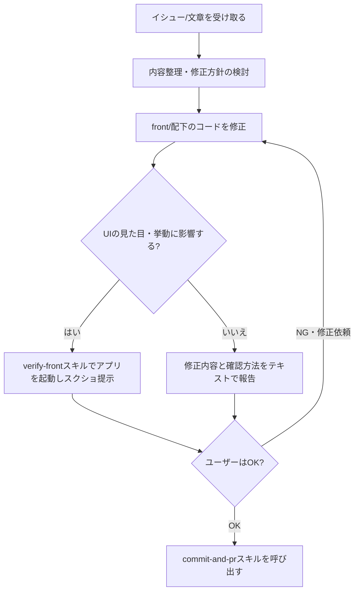

# イシューから動作確認・PR作成までの一連の流れ

「イシューや文章で修正内容を伝えたら、直してもらって、動作確認のスクショを見てOKならコミット・PRまでお願いしたい」という依頼に応えるためのワークフローです。修正だけして終わり、動作確認をすっ飛ばしてコミットしてしまう、といった抜けを防ぐために手順化しています。

## なぜ動作確認を挟むのか

このリポジトリ（`front/`）はテストランナーが整備されていません（`CLAUDE.md`参照）。つまりコードの正しさを保証する自動テストが存在しないため、UIに関わる変更は人間の目で見た確認が唯一の品質担保になります。修正が終わった時点でいきなりコミット・PRまで進めてしまうと、見た目が崩れていたり意図と違う挙動になっていたりしても誰も気づけません。だからこそ「修正→スクショ提示→ユーザーのOK→コミット・PR」の順序を絶対に飛ばさないことが重要です。

## 全体の流れ

### 1. イシュー・依頼内容を整理する

ユーザーから渡されたイシューの文章、Slackスレッドの引用、口頭の依頼などを読み、次を明確にしてから着手します。

- 何が問題/要望なのか（現状の挙動 → 期待する挙動）
- 対応範囲はどこまでか（関連しそうだが今回は触らない部分があれば明示的に切り分ける）
- 修正対象は`front/`配下のどのファイルになりそうか（`App.jsx`が状態とロジック、`lib/tasks.js`がデータ層、`components/TaskItem.jsx`が表示専用、という役割分担は`CLAUDE.md`参照）

内容が曖昧で複数の解釈がありうる場合は、着手前にユーザーに確認してください。憶測で実装を進めて後から手戻りになる方がコストが高くなります。

### 2. コードを修正する

`CLAUDE.md`の規約（コンポーネントは関数宣言＋hooks、スタイリングは`style.css`の既存CSS変数を拡張、UI文言は日本語・識別子とコードは英語、など）に従って修正します。ここではまだコミットしません。

### 3. 動作確認する

**UIの見た目や挙動に影響する変更**（表示の追加・変更、色分け、レイアウト、操作フローの変更など）の場合は、`verify-front`スキルを使って実際にアプリを起動し、修正後の画面のスクリーンショットを撮影してユーザーに提示してください。`verify-front`スキルはPlaywrightでのスクリーンショット撮影とconsoleのerror/warning採取、devサーバーの確実な停止までを面倒見てくれるので、`npm run dev`を素朴に叩くよりこちらを使ってください。可能なら以下も一緒に確認・提示すると手戻りが減ります。

- 修正前後の比較（該当する画面の変更前・変更後のスクショ、または変更点の指摘）
- 該当機能を実際に操作した結果（例: タスク追加→期限に応じた色分けが反映されるか）
- コンソールエラーが出ていないか

**ロジックのみでUIに影響がない変更**（内部処理の整理、`lib/tasks.js`のバリデーション修正など見た目に現れない変更）の場合は、スクショの提示を省略してよいですが、その旨と「なぜUIへの影響がないと判断したか」「代わりにどう確認したか（`npm run build`が通ることの確認など）」をテキストで報告してください。省略の判断自体を勝手に広げすぎないよう注意してください（少しでも表示に関わる可能性があれば見せる側に倒す）。

### 4. ユーザーの確認を待つ

スクショまたは確認内容を提示したら、次のアクションに進む前に必ずユーザーの反応を待ちます。

- **OK**が出たら次のステップへ進みます。
- **NG・修正依頼**が出たら、ステップ2に戻って修正し、再度ステップ3で確認します。この往復は何度でも構いません。
- ユーザーからの応答がまだない状態で先にコミットやPR作成を進めることは絶対にしないでください。「OKが出るまでコミットしない」がこのスキルの核です。

### 5. commit-and-prスキルでコミット・PR作成する

ユーザーのOKが出たら、コミット・PR作成のロジックをここで重複実装せず、`commit-and-pr`スキルを呼び出してください。クレデンシャルチェック、コミットメッセージ規約（英語の命令形、Conventional Commitsプレフィックスなし）、PR説明文のテンプレート準拠（日本語、`.github/pull_request_template.md`の見出し構成、必要に応じてMermaid図）は`commit-and-pr`スキル側の手順に従うため、ここでは触れません。

PRの「起票の元になったチケットまたは投稿」セクションには、ステップ1で整理した元イシュー・依頼内容を、「テスト内容」セクションには、ステップ3で実際に行った動作確認の内容（スクショで確認した操作、または省略した場合はその代わりに確認した内容）を具体的に反映してください。
