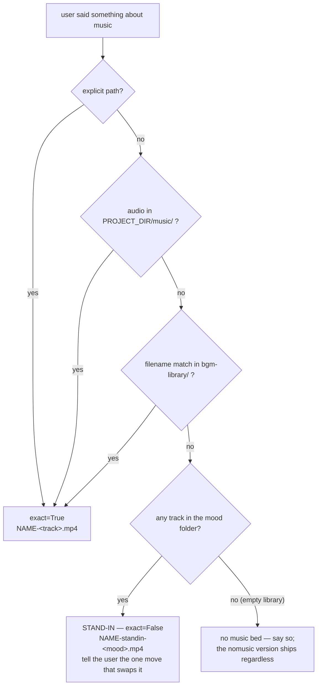
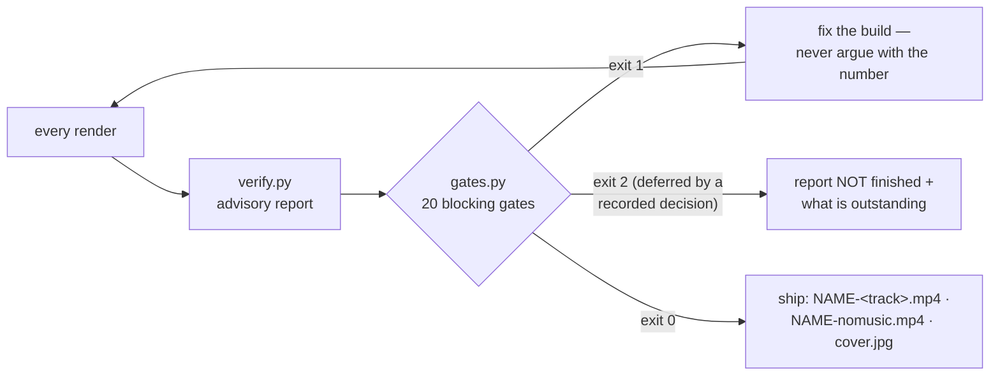

# yiibu — Video Post-Production

All shell commands in this document run from the skill root (the directory
containing this SKILL.md), wherever it is installed.

Automated pipeline for turning raw selfie recordings into polished 9:16 short-form videos.

## Division of labour

**The user shoots. You select.** They hand over a folder; deciding which shots
earn a place, in what order, and how long the result runs *is* the edit. Do not
ask them to pick clips — that is the work. Do ask when a fact on screen is
unreadable, because they were there and you were not.

New to this skill or a new machine: `python3 doctor.py` (needs only ffmpeg,
Pillow, numpy — the font is bundled, everything else degrades cleanly).

## Why so much of this is code and not advice

The same footage should come out at the same STANDARD whoever is driving —
caption style, audio targets, cover geometry, honest reporting of what is
unfinished. Not the same cuts or the same rhythm; those are judgement and should
differ. The standard should not.

Prose cannot deliver that. Every rule left as a sentence in this file gets
re-derived by whoever reads it next, and the record is that they re-derive it
differently — or skip it and report success. So the rules that matter live in
three places that do not depend on anyone agreeing with them:

| mechanism | what belongs there | why |
|---|---|---|
| `house_style.json` + `gates.py` | measurable, stable threshold, defect survives human review | a number outside the threshold blocks the hand-over |
| **code defaults** (`cover.draw()`, `modules/bgm.py`) | the house look and the safe construction | drifting from it requires a deliberate act, not forgetfulness |
| `decisions.json` | choices only the user can make | the build cannot proceed by quietly picking one |

Three rules for adding to the first row, all learned by getting them wrong here:

- **No gate without a reproducible threshold.** The first `gate_music_bed` used
  an absolute -40 dBFS line that sat inside AAC coding noise; identical settings
  measured 1.18s of dead tail on one rebuild and 2.93s on the next. A gate that
  flaps gets tuned until it passes, which is the failure it exists to prevent.
  If it cannot be measured stably, make it a code default instead.
- **A new authoring path loses guarantees the old one gave for free.** Ask what
  they were. ASR-timed captions cannot overlap — each phrase ends where the next
  begins — so nothing ever needed to check for collisions. The food template's
  "author your own captions" removed that guarantee silently, and two hand-timed
  lines rendered on top of each other for 0.45s with every caption gate green.
  Whenever you add a way to produce something, list what the previous way made
  impossible, and gate whichever of those is now merely unlikely.
- **No gate a null result can satisfy.** Ask what an empty or absent input
  does to the check before it lands. `gate_structure` asked whether
  `endcard.png` exists and whether the last frame matches it; a still grabbed
  from the final clip answers both, at 0.99, because it IS that frame. The
  rule it stood for — the closing card is where the viewer learns what the
  thing is called — was never encoded, only proxied. See
  `CONTRIBUTING.md` for the three that have had this shape.
- **No gate without a test.** `tests/test_gates.py` reconstructs each defect and
  asserts the gate still rejects it. A gate added without one rots silently, and
  that has already happened once in this file's history.

Everything else — hook choice, shot order, cover wording, which take to use — is
judgement, and a wrong call there is visible in the first watch. Leave it free.

## Intake — one required input, assumptions stated, not interrogated

The only thing you cannot proceed without is **the footage folder**. If it is
missing or empty, ask for it — that is the single blocking question.

Everything else has a default. Do NOT run a questionnaire; instead, resolve the
defaults and **state the plan in one message before cutting**, so the user can
veto any line of it in one reply:

| knob | default | overridden by |
|---|---|---|
| template | auto-detect from the footage (event / food / running / talking-head) | user naming one |
| length | `plan.py` recommendation — say the number | user's target |
| platform | reels (9:16) | user's platform |
| music | `resolve_music.py` — never stalls, see below | a track / "no music" (both versions ship regardless) |
| language | zh-TW captions | user's language; bilingual via `house_style.local.json` |
| cover & hook | strangest image in the folder | user's pick |

Questions are reserved for what only the user can know: an unreadable on-screen
fact (they were there, you were not), a privacy/NDA boundary (unreleased
roadmap slides, people who should not appear), or footage that contradicts its
own filenames. One batched message, never a drip of one-question turns.

**Who may publish this is one of those questions, and it does not get asked on
every build.** Run the scan; it only speaks when it has something:

```bash
python3 clearance.py SOURCE_DIR --work-dir WORK_DIR
```

Filenames first (free), then one small vision call per clip. Food, running and
family footage trip nothing and the user never hears about it. Session-shaped
material raises the question BEFORE the cutting, which is the point — a 93.6s
recap once reached hand-over with all its gates green and 41 of those seconds
under NDA, and the cost of finding out afterwards was the whole edit.

Take the answer to whoever ran the event, then write it down:

```jsonc
"clearance": {
  "value": "mixed",                       // public | internal | mixed
  "why": "organiser cleared 週邊花絮; sessions and the Q&A are embargoed",
  "excluded": ["IMG_3353_devrel_sharing.MOV", "IMG_3370.MOV"]
}
```

`gate_clearance` then does the half a machine can do: it derives whether this
build even needs an answer from the timeline's own source filenames, and it
fails if a clip you excluded is in the cut anyway. It never decides what is
embargoed — nothing in the pixels can.

A well-formed request looks like (all lines after the folder optional):

```
剪影片 ~/Downloads/0814_shanghai
活動：Google GDE Summit 上海，一日活動花絮
平台：IG Reels，60-90 秒
音樂：輕快，副歌開場
注意：投影片上未發布的 roadmap 細節不要放大；結尾放 IMG_3400 合照
```

`剪影片 <folder>` alone is also a complete request — the defaults above fill
the rest, announced before the first cut.

## Step 0a — read the house style BEFORE building anything

```bash
python3 gates.py --preflight
```

Prints the locked spec — font, caption sizes, pill method, cover geometry, the
hook and end-card requirements — straight out of `house_style.json`, which is
what the shipping gates actually read. **That file is the single source of
truth**; SKILL.md and `references/*.md` explain it, they do not define it.

A project may override any key by writing `WORK_DIR/house_style.local.json`
(e.g. `{"bilingual": {"required": true}}`). Overrides are allowed but must be
written down — `gates.py` prints every active one, so a reviewer sees what was
exempted instead of guessing.

## Step 0 — plan the length BEFORE cutting

```bash
python3 plan.py SOURCE_DIR --platform reels
```

Prints a recommended duration, the payload beats it found, shot-length bands and
hook candidates. **Say the number to the user up front** — it is something they
can argue with in one line; discovering the length after eleven versions is not.

Length is derived from **retention structure, not footage volume**:

```
length = hook(2-3s) + Σ payload(8-14s) + connective(~25%) + ending(4-6s)
```

The opening 2 seconds decide the scroll, so the hook is the strangest image in
the folder — not a sign, not walking in; if it lives at 4:51 of a long clip,
that is frame one. Under three payloads there is no reason to watch; over six
and none of them breathe. When it feels long, cut connective tissue, never
payloads.

The shot bands are measured from a reviewed-and-accepted edit; the platform
ranges are conventions, not research. Do not invent retention statistics to
justify a length.

**Pacing comes from content, not from music.** Cut the no-music version until it
holds on its own, then decide about a track. If a cut only works while the song
is playing, the cut is wrong — and you cannot tell which it is once the music is
on. This is also why both versions ship (below).

## Always deliver BOTH a music and a no-music version

Different platforms and different reposts want different ones, and the no-music
version is the honest record of the day. Gate both — a mix problem usually shows
up in only one of them.

**Encode deliverables at a DELIVERY bitrate, not the intermediate one.**
`buildkit.VENC` is deliberately fat (20 Mbps) so repeated passes do not stack
loss; `final_encode(..., delivery=True)` — the default — uses
`DELIVERY_VENC` instead. At the intermediate bitrate a 90-second reel came out
**211 MiB**, too big to hand to anyone and re-compressed by every platform
anyway. Same 1080x1920 picture, ~24 MiB. Override with `YIIBU_DELIVERY_BITRATE`;
pass `delivery=False` only for an archival master.

**Deliverables land in the PROJECT ROOT — the same three files, every project:**

```
PROJECT_DIR/                      e.g. ~/Desktop/gde-summit-0814/
  NAME-nomusic.mp4                original audio only
  NAME-<track>.mp4                music bed + ducking
  cover.jpg                       the standalone cover ships alongside
  build/                          scripts + every intermediate artifact
```

Never scatter outputs on ~/Desktop or leave them only inside build/ — the user
picks them up from the project's first level (locked 2026-08-16, user request).

## The music step NEVER stalls the build

```bash
python3 resolve_music.py "<whatever the user said about music>" PROJECT_DIR
```

The user usually names a track — an artist and a title, a screenshot of a player,
a link — not a file path. That is a name, not audio, and the build used to stop
there and wait for a human. It must not. `resolve_music.py` walks a ladder that
always terminates and reports which rung answered:

1. an **explicit path** the user gave
2. any audio file in **`PROJECT_DIR/music/`** — the drop-in slot
3. a **filename match** for that name inside `bgm-library/`
4. a **mood-matched stand-in** from `bgm-library/`



Rungs 1–3 are the real track (`exact=True`). Rung 4 is not, and the deliverable
has to say so: name it `NAME-standin-<mood>.mp4`, never `NAME-<their-track>.mp4`.
Labelling a stand-in as the requested track is the failure this exists to stop —
the user cannot hear the difference in a filename and will publish it.

**A commercially released song cannot be fetched by this pipeline.** Do not rip
it from a streaming site, and do not build or suggest tooling that does. The only
route to that exact track is the user dropping the file into `PROJECT_DIR/music/`,
which is one move and needs no rebuild of anything else. So: ship the stand-in,
tell them that one move in a single sentence, and keep going. Offer the licensed
alternatives (their own library, the bundled `bgm-library/`, a royalty-free
source) once — do not re-litigate it on the next turn.

### Which track is one question; WHERE to start it is another

```bash
python3 music_entry.py TRACK --length 48
```

`resolve_music.py` answers *which*. This answers *where*, and it exists because
"enter on the chorus" was prose and prose is not a method: on 2026-08-21 that
instruction was carried out by picking the hottest sustained window, reported to
the user as a chorus entry, and it was six seconds early — the tail of the
pre-chorus. The user asked directly and the honest answer was no.

Two methods that do NOT work, both tried on that track:

- **energy** — modern masters are compressed flat; chorus, busy verse and bridge
  all sat within 1 dB and the whole curve read `▇▇▇▇▇`;
- **chroma repetition** — the textbook "a chorus is the harmony that recurs"
  collapses on anything over one chord loop: every candidate scored 174-179
  recurrences out of 196 possible. Indistinguishable, and confidently so.

What works is **timbre**: a chorus is where the arrangement fills in. Foote
novelty over log-mel features finds the boundaries, arrangement fullness names
the chorus, a kick grid snaps the entry to a downbeat. The tool also prints the
first 10s of each candidate, because a quiet bar of the song landing under your
hook reads as "the music is broken" — the same build shipped that too.

`--no-bgm` / "不要配樂" still ships both files; the music one just uses the
stand-in ladder for the bed and the nomusic one is the honest record.

> **Wired into `postprod.py` via `--music "<what the user said>"`** — the bgm
> step passes it to `resolve_music.resolve()` before falling back to mood
> selection. Folder-of-clips builds (running / event / food templates, which
> write their own `vp_build.py`) call `resolve_music.py` themselves; a
> hand-written build must too.

## Explain what is on screen — and look it up when you cannot

The audience did not attend. A shot of a booth means nothing without a caption
saying what it is, so **research is part of the edit**, not a bonus:

- read the signage/slides at **full resolution** before writing the caption;
- if a product or term is still unclear, look it up (`curl` with a browser UA, or
  ask the user — they were there). Do not caption from a guess;
- **do not invent a STANCE, either.** The fact rules below are about what is
  true; this one is about attitude. A build opened on "這間店的名字比這盤肉還好笑"
  — treating the shop's name as a joke — which nothing in the footage supported
  and which made fun of the place the user was recommending. An invented tone is
  as much a fabrication as an invented number, and it is harder to spot because
  no caption states it outright. The user is vouching for these people; write
  from that;
- anything that came from outside the footage must be checkable, and **on-screen
  evidence always wins** over a memory or a plausible name. A blurry wordmark
  reading `Lite…js` is not enough to write `LiteRT.js` — it turned out to be
  `LiteRT-LM.js`, a different product;
- conference screens carry the speaker's own subtitles: use them to correct ASR.
  They fixed two words Whisper scored at 1.00 confidence.

## Capability map — everything this skill can put on screen

An agent (or the user) cannot ask for what it does not know exists. Several of
these shipped in code for months with ZERO mention in this file — Ken Burns,
the transition set, both cutout variants — and were therefore never used.
If you add an effect, add its row; an undocumented capability does not exist.

| effect | what it looks like | how to trigger |
|---|---|---|
| fullscreen B-roll + circular PiP | asset full-frame, speaker in a ringed circle | `BROLL_LAYOUT="fullscreen"`; geometry via `PIP_SIZE` / `PIP_POSITION` / `PIP_MARGIN_TOP` |
| background layout | B-roll behind a centred selfie | `BROLL_LAYOUT="background"` |
| split layout | B-roll top 55%, selfie below, gradient blend | `BROLL_LAYOUT="split"` |
| split-1to1 | half/half with gradient seam | per-segment in `mixed` layout |
| cutout-large / cutout-small | segmented speaker standing IN FRONT of the asset (MediaPipe) | `mixed` layout / `cutout.render_cutout_segment`; geometry via `BLS_*` |
| mixed | per-segment rotation of the above, ≤2 consecutive same | `BROLL_LAYOUT="mixed"` (default) |
| Ken Burns on stills | slow pan/zoom on images, 4 directions | automatic for image B-roll |
| punch-in on video | 8% push over the shot | `buildkit.punch_in` |
| entry/exit transitions | fade / zoom_in / slide_left / slide_up, 0.4s | `BROLL_TRANSITION_TYPES` |
| fit-with-blur | taller-than-9:16 screen kept whole, blurred self as sides | running-vlog build pattern (0816 build) |
| two-layer captions | 84px white + 48px dim EN line | `decisions.json captions:on` + bilingual local override |
| gold keywords | 90px #F6DB66, scaled to 120% with a `\t()` pop, inside the white line | `《word》` markup / subtitle module keyword bank. **Gated (min 3 spans) only on passes that use a `Speech` style** — authored-caption builds are not checked for it |
| emphasis / hero captions | 132px staggered stack at the emotional peak, face-aware | `SUBTITLE_EMPHASIS_ENABLED` |
| top pill | PIL rounded capsule naming the thing, 18% height | `title.render_title_png`; **gated** |
| top-title banner | persistent or opening-only hook line | `--top-title`, `--top-title-mode` |
| title card | bold centre card in first 2.5s | `--title` / `--card-subtitle` |
| CTA overlay | screenshot slides in on the closing phrase | `--cta-image`, auto-detected timing |
| cover as frame 1 | designed JPG burned into the first frame | `cover.build` + `overlay_on_first_frame`; **gated** |
| end card | closing PNG beat (e.g. group photo) held at the end | `decisions.json end_card:on` → `modules/endcard.py` `build()` writes `endcard.png` **and `endcard_meta.json`**; **gated**, tail must not be silent, and the card must DECLARE the text on it — a still grabbed from the last clip satisfied every other check (2026-08-23) |
| clap-mistake removal | clap once to delete the 3s before it | silence step, automatic |
| silence trim | speech-band RMS profiling, outdoor-safe | silence step / running template §3 |
| music bed + duck | named track via ladder, numpy duck, plays to the last sample | `--music "<what user said>"`; **gated** |
| selective original audio | the room is heard only where its sound is the payload — a voice, a sizzle, a boil, the pot landing — and the music has the rest of the running time to itself | `decisions.json audio_policy: selective` + a `keep` per segment → `audio_policy.json`; evidence from `modules/audio_scout.py`; **gated** |
| transition SFX | whoosh at topic changes | `--sfx`, auto-detected topics |
| loudness | measured constant gain, limiter −3.5 dBFS | `decisions.json loudness` |

A picture of each of these, with the phrase that triggers it, is in
[docs/CAPABILITIES.md](docs/CAPABILITIES.md) — that page is for the USER, since
an agent reading this file cannot see an image.

Worked build scripts using these live in `references/examples/`; rendered demo
GIFs are in `docs/demo/`. A capability reel (one 2s beat per effect) is the
intended showcase once brand assets land.

## The 15-minute budget — and the two tools that keep it

A complete folder-of-clips build (cut + captions + B-roll + pills + both mixes
+ gates) is a **10–15 minute job** on this machine. The 2026-08-17 build took
~1 hour, and every lost block traced to a hand-written ffmpeg graph re-deriving
a trap this skill had already documented. Two mechanisms now stand between a
build script and that hour:

1. **`modules/buildkit.py`** — the proven primitives: `prep_segment`, `concat`,
   `punch_in`, `overlay_pills`, `burn_subtitles`, `duck_mix`,
   `measure_gain_db`/`afx_chain`, `final_encode`. Each one encodes the traps
   (videotoolbox, PCM intermediates, finite qtrle pills, sequential overlay
   passes, zoompan, bed-length assertion, decoded-peak abort). **Compose these;
   writing a raw ffmpeg graph for something buildkit covers is the failure
   mode**, not a style choice.
2. **`build_lint.py WORK_DIR/your_build.py`** — run it BEFORE executing any
   build script, and again after editing one. Exit 1 on the known slow/hang
   antipatterns (libx264, bare `-loop 1`, animated crop, sidechaincompress,
   inline loudnorm). gates.py checks the OUTPUT; this checks the CONSTRUCTION,
   which gates never see because the file that eventually appears looks fine.
   As a backstop, **importing buildkit self-lints the calling script**: a build
   script carrying an antipattern refuses to start instead of stalling 20
   minutes in (`YIIBU_SKIP_LINT=1` + a written reason is the escape hatch).
   Note buildkit hardcodes `h264_videotoolbox`, so template builds are
   macOS-only today; `postprod.py`'s compose path falls back to software
   encoding off-macOS.

Rough per-step targets for an ~85s reel: segments+concat ≤2min, ASR ≤4min
(cache `words.json`; re-run only when a cut point moves), B-roll prep ≤2min,
compose ≤1min, both final encodes ≤3min, gates ≤1min. If a step is blowing its
target, stop and check the encoder and the graph before letting it run — a
20-minute encode is never "just slow", it is the wrong encoder.

**Those targets assume ONE source video.** A folder build transcribes the whole
folder, and the budget does not survive it: 43 clips / ~1000s of audio took
**16 minutes** of ASR against a 4-minute line, with a hung run before it. For a
folder, budget ASR separately at roughly **1× realtime of total audio** and
protect it, because both failure modes are silent:

- **Never pass an `initial_prompt`.** On noisy audio Whisper returns the prompt
  itself as the transcript, at ordinary-looking word probabilities. Nothing
  downstream can tell that from speech; it would have shipped as a quote the
  person never said. `modules/transcribe.py` now refuses such a transcript via
  `asr_sanity()` — keep that check ahead of any caption work.
- **Cap each clip.** large-v3 loops forever on near-silent audio (observed: >4
  minutes on a 1.5s clip). Run each clip under a wall-clock cap, and skip clips
  whose `max_volume` is below about −25 dB — there is no usable speech there.
- Delegate the per-clip pass to `footage-scout` / `transcript-proofer` if you
  want the tokens out of your own context; it does not make it faster.

## Decisions that are the user's — record them, never default them

```jsonc
// WORK_DIR/decisions.json — REQUIRED, gates.py fails without it
{
  "loudness":  {"value": "-14LUFS", "why": "published promo, user did not veto"},
  "audio_policy": {"value": "selective", "why": "nobody narrates; the room is kept only where it sounds like something"},
  "captions":  "on",
  "end_card":  {"value": "off", "why": "closes on a beat the user chose to keep"}
}
```

| key | values | which one needs a written `why` |
|---|---|---|
| `loudness` | `original` / `-14LUFS` | `-14LUFS` — delivery-traps #1 says ask first |
| `captions` | `on` / `deferred` | `deferred` |
| `end_card` | `on` / `off` | `off` |
| `audio_policy` | `full` / `selective` | **`full`** — original audio under the WHOLE video is the answer that has to argue for itself |
| `clearance` | `public` / `internal` / `mixed` + `excluded[]` | anything but `public`; required as soon as a source filename looks like session footage |

These used to be prose, and prose does not bind anyone: two consecutive builds
normalised loudness against the rule that says to ask, and both reported "done".
A value that departs from the documented default needs a `why` the user actually
agreed to — not a rationalisation written after the fact. `captions: "deferred"`
is what makes a no-subtitle preview legitimate; without it the caption gates
still block, so the deferral cannot be assumed into existence.

## Before shipping — ONE ADVISORY REPORT, THEN THE BLOCKING GATES

```bash
python3 verify.py WORK_DIR --output FINAL.mp4    # advisory — cannot stop anything
python3 gates.py  FINAL.mp4 --work-dir WORK_DIR  # BLOCKING — this is the edge to "ship"
```

This heading used to read "TWO GATES, BOTH BLOCKING", and `verify.py` used to
end its report with **`VERDICT: ✅ PUBLISH READY`**. Neither was true: verify.py
runs eight checks, never reads `house_style.json`, and returns an opinion. It
now says `ADVISORY CHECKS CLEAN — NOT a shipping verdict` and prints the command
below it, because a green advisory report that says "publish ready" is the one
sentence most likely to end a hand-over early — and an agent that believes it
has not disobeyed anything.

**`gates.py` has three exit codes and they mean different things:**

| exit | meaning | what to tell the user |
|---|---|---|
| `0` | shippable | it is finished |
| `1` | something is broken | what failed; do not hand over |
| `2` | nothing broken, but gates were **deferred** by a recorded decision | it is **not finished**, and which parts are outstanding |



Exit 2 exists because "I deferred the captions" and "it is done" are different
sentences and kept getting reported as the same one. Treat a non-zero exit as
the answer to "is this finished", not as an obstacle to argue with. Run it on
**every** render — a version that passed yesterday is not evidence about today's
file.

`gates.py` **exits non-zero and blocks the hand-over.** Run it on every render,
not just the last one — a version that passed yesterday is not evidence about
today's file. Wire it into your own render script as the final step so producing
an output implies gating it.

### Staging: let the gate claim the final name

The strongest version of "you cannot ship what was not gated" is not another
check — it is removing the path. Build the deliverables into the work dir under
whatever names the script uses, declare them, and let a passing gate run be the
thing that puts them at the project's first level:

```python
bk.stage_delivery(WORK, {"vp_music.mp4":   "devjam-recap.mp4",
                         "vp_nomusic.mp4": "devjam-recap-nomusic.mp4",
                         "cover.jpg":      "cover.jpg"})
```

That writes `WORK_DIR/delivery.json`. From then on `gates.py` moves the set out
**only on exit 0** — a blocked run (1) and a deferred run (2) both leave every
file in the work dir, because a file at the project's first level is a claim
that it is finished. Forgetting to gate no longer yields an unchecked video; it
yields no video, which is a failure that reports itself.

The `Deliverables` gate reads the declared set rather than listing the
directory when this is in play — inside a work dir the listing check passes for
the wrong reason, since `spine.mov` and `trimmed.mp4` both read as "a music
version".

Declaring nothing keeps the old behaviour exactly: gate the file where it lies,
publish nothing.

**Two things now run it for you, and neither replaces reading this section.**
`postprod.py` step 7 runs verify.py and then gates.py, and exits with the gate's
own code. And in Claude Code a `Stop` hook (`hooks/gate_guard.py`, registered in
`hooks/hooks.json`) refuses to end the turn if a video was produced that no gate
run recorded, that the gates blocked, or that was re-rendered after the last run.
It decides on `build_log.jsonl`, which only `gates.py` writes.

What that buys is narrow, and worth being exact about: it removes *forgetting*
as a failure mode in this driver. It does not make a green build correct — the
gates are still blind to truth and omission (see **Coverage**, below), a
`house_style.local.json` override still silences whatever it names, and a video
built by hand with no yiibu artifacts leaves the hook nothing to see. Template
mode has no automatic driver at all: there you type the command.

**The rule that matters more than any threshold:**

> Do not reason about whether a measurement is acceptable.
> A number outside the threshold is a failure **even when you can explain it**.

A silent ending shipped twice in one session. Both times the level was measured,
seen, and talked away — "that's the song's own outro", "that's the tail fade".
Explaining a number is not checking it.

What `gates.py` blocks on, and the defect each one shipped:

| gate | catches |
|---|---|
| Decisions | no `decisions.json`, or a user choice (loudness / captions / end_card) defaulted silently or without a written why |
| Audio | dead air >0.8s, silent ending (<-32 dBFS), clipping |
| MusicBed | the music bed dying before the video does — measured by subtracting the no-music sibling; no sibling pair is itself a failure |
| AudioPolicy | a segment whose audio nobody decided about, and (reported, not blocked) `kept_but_masked` — segments kept for a sound the bed is louder than, and a policy that is declared but not applied (muted spans must measure `min_applied_db` below the kept ones on the finished no-music file) |
| Duck | a bed that never gets out of the way of the speech, measured the same way. `duck_mix` used an ABSOLUTE trigger, so it ducked a close mic 7-9 dB, room-distance speakers 2-3 dB, and 8.5 dB under paper being turned |
| Dwell | a caption on screen for less than `captions.min_dwell_s`. plan.py carried this floor as advice for a long time and nothing enforced it |
| Deliverables | the music / no-music pair or `cover.jpg` missing from the project root |
| CoverColour | cover subtitle not the house gold, measured off the rendered pixels |
| Cover | no cover, frame 1 isn't the cover, title too small for a feed |
| Captions | overflow past the safe area, styles not declared in `layout.json`, captions away from their declared anchor, nested colour tags, **two captions on screen at once in the same place** (ASR-timed lines are sequential by construction; hand-timed ones are not) |
| Pill | pill running edge-to-edge, pill off the 18% house position |
| Delivery | PTS≠0 black first frame, audio/video length mismatch |
| Typography | wrong font, wrong caption size, black outline instead of drop shadow, `\fad` where the house style is a hard cut, an all-white pass with no gold keyword spans (`Speech`-styled passes only), half-translated bilingual captions |
| Structure | no hook in the first second, no end card, the video not ending on it, or an end card that declares no text — a screenshot of the final clip passed every other check |
| Sync | a verbatim caption whose words are not in the audio under it: first word cut off by the segment in-point, caption late/early, wrong line over the shot, or a whole `words.json` gone stale after a cut moved |
| Clearance | source footage that looks like session material with no recorded answer about who may publish it — and any source the user excluded that reached the cut anyway |
| Transcription | a source clip in the cut that was never asked whether anybody is talking in it — and speech that was found but reaches no caption |

Typography, Structure and the strengthened Pill gate exist because a rebuild
shipped ASS-box pills and 62pt outlined captions **with every other gate green**.
Position was checked; the look was not. `tests/test_house_style.py` reconstructs
each of those defects and asserts the gate rejects it, so the gates cannot rot
back.

**Gates check position, not style.** `gates.py` passing says you did not trip a
known landmine; it does not say the video looks like the last one. Typography —
font size, outline-vs-shadow, whether the pill is a PIL capsule or an ASS box,
fades — is invisible to every gate. Before building captions or pills, open the
previous build directory for that template and copy its style block; the locked
spec for events/interviews is in `references/event-vlog-template.md` §2.1.
House default for both layers is a **hard cut — no fades**.

**Every caption style must be declared** in `WORK_DIR/layout.json` as `caption`
(70% baseline), `pill` (18%) or `free`:

```json
{"Speech": "caption", "Note": "caption", "Hook": "free", "CardBig": "free"}
```

An undeclared style is a FAILURE. The first version of this gate used a name
allowlist and silently passed anything named differently — which is the exact
class of bug it exists to catch. `free` is allowed, but it has to be written
down: a deliberate exemption, not a hole.

A **missing artifact is a FAILURE, not a skip.** `verify.py` warns and moves on
when `subtitles.ass` or a cover is absent; that is exactly how a whole edit
shipped with no cover at all. `gates.py` fails instead.

Two rules from `references/delivery-traps.md` that override defaults:

- **Do not normalise loudness unless the user asked.** A personal 花絮/vlog
  ships at the original recording level. The `-14 LUFS` target is for published
  content only. Preventing clipping is the one exception that needs no ask.
- **Never judge audio by the filter graph.** `ebur128` in-chain read -1.0 dBFS
  on a file that decoded at +1.57 dBFS with 315 clipped samples.

## Cover — mandatory, and it is frame 1

Use `modules/cover.py`. Never hand-roll it: the constraints below are what make
it readable in an IG feed, and they were all learned the hard way.

- **At most two title lines.** `cover.draw()` raises on three. Fewer characters
  is what makes the type big — the sizer trades point size for character count.
- Title says the **experience**; product and platform names go in the
  **subtitle**. "戴上 Android XR" is wrong to a developer audience — Android XR
  is the platform, the thing you wear is the glasses.
- Event name belongs in the post caption, not the cover. On the cover it is the
  longest, smallest line and it is not why anyone stops scrolling.
- Burn it with `cover.overlay_on_first_frame()` — an **overlay** on frame 1.
  Prepending a cover segment to the concat shifts every caption by a frame.

## What the gates CANNOT see — and who to ask instead

Every gate here checks for a **defect**. Two whole classes of wrongness are
invisible to that by construction, and both shipped past a full green board:

| blind spot | what it looked like | who catches it |
|---|---|---|
| **truth** | a caption tightened into something nobody said, or a fact nothing on screen supports | `slide-reader`, `transcript-proofer`, `edit-critic` |
| **omission** | three of six subjects got two shots, the other three got four | `coverage.py`, `edit-critic` |

> **All gates green does not mean the video is good.** It means you did not trip
> a known landmine. Say "it passes the gates", never "it is finished", until
> someone has watched it.

`python3 coverage.py WORK_DIR` prints screen time per subject and is also
printed automatically under every `gates.py` run. It is deliberately NOT a gate:
how long a subject deserves is a judgement, and a threshold would only be argued
with. Declare a `topic` per segment — the filename fallback will credit your
hook and your closing shot to whichever team's clip they were cut from.

## Portability — this must not be a Claude-only standard

**`AGENTS.md` (at the repo root) is the portable contract.** Every rule in this skill is reachable
by running a command, so Codex, Antigravity, another model or a plain script
gets the same standard as Claude Code. That is deliberate:

> Quality lives in the executable checks, never in the agent driving them.
> Anything that depends on the agent remembering, noticing, or being clever is
> not a standard — it is a hope.

Which means the Claude-Code-specific parts of this skill — `agents/*.md` — are
**accelerators, not dependencies**. Anything they do that is load-bearing has a
command:

| Claude-only | portable equivalent |
|---|---|
| `transcript-proofer` agent | **`python3 proofread.py WORDS --media CLIP`** — sanity-checks for prompt echo and decoder loops, re-runs suspect spans, exits 1 when the transcript cannot be trusted |
| `footage-scout` agent | `plan.py` + `ffprobe` (check `side_data_list` rotation) |
| `slide-reader` agent | extract stills at full resolution and read them |
| `edit-critic` agent | **`python3 review.py WORK_DIR --output FINAL.mp4`** + `coverage.py` |
| judging a music entry by ear | **`python3 music_entry.py TRACK`** — section map, chorus candidates, downbeat-snapped entries |
| judging a mix by ear | **`python3 mixcheck.py WORK_DIR --music F --nomusic F`** — per kept segment, is its sound audible over the bed IN ITS OWN BAND |

If you add a rule to this skill, add the command that enforces it. A rule that
only exists in prose is one a different driver will not follow — and, on the
evidence in this repo, one that Claude will not follow either.

## Sub-agents: delegate EVIDENCE, never JUDGEMENT

Four agents ship in the plugin root's `agents/` — installing the yiibu plugin
installs them; a bare clone copies them to `~/.claude/agents/`:

| agent | when | why it is worth a separate context |
|---|---|---|
| `footage-scout` | start of a folder build, before cutting | looking at every clip costs enormous image tokens; it returns an inventory instead of the pictures |
| `slide-reader` | before writing any caption stating an on-screen fact | full-resolution reads, verbatim, with an explicit "unreadable" list |
| `transcript-proofer` | after transcribe, before subtitles — **required** when captions quote speech | re-runs ASR on suspect spans and returns measured probabilities as evidence |
| `edit-critic` | after the gates pass, before hand-over | adversarial: traces every claim back to evidence, reports coverage |

**Do not put the edit itself behind an agent.** Choosing which shots earn a
place, in what order, where the hook lands and how long it runs requires holding
the whole folder in mind at once — that IS the edit, and a list handed back from
an isolated context cannot be sanity-checked without redoing the work. The same
goes for caption wording, which depends on the story spine, the facts and the
ASR confidence together.

Worth knowing before reaching for more agents: of the defects in the 2026-08-19
build, **none** were caused by a crowded context. They were unmeasured claims,
missing gates, and shell/tool traps. Agents buy you evidence-gathering at scale;
they do not buy correctness. A gate does.

## The build log

`gates.py` appends to `WORK_DIR/build_log.jsonl` and rewrites `BUILD_LOG.md` on
every run — not a separate command, because a logging step you have to remember
is one that gets skipped (the same reasoning that put the lint on buildkit's
import). It records what the machine can PROVE: verdict, which gates failed,
attempt number, output geometry/bitrate/size, segment and source counts, ASR
word count, host encoder, and the coverage table.

The most useful field is the one that is easy to skip: **how many attempts, and
which gates rejected which one.** "Shipped first time" and "shipped on the
seventh render after four rejections" are different stories about the same file.

Token counts, wall-clock time and the name of the model driving the edit are
**not observable** from a build script. Write them into `WORK_DIR/notes.json` at
the end of every run; `gates.py` copies them into the log under `self_reported`,
and BUILD_LOG.md now prints that heading even when the file is absent, so an
unrecorded run says so out loud instead of looking like a run with nothing to
report. This used to read "if you want them kept", and on 2026-08-22 three
agents in a row kept nothing — the benchmark could not answer what any of it
cost. Do not launder a self-reported number into the measured section.

```jsonc
// WORK_DIR/notes.json — claims, not measurements
{"model": "…", "tokens_in": 0, "tokens_out": 0, "wall_clock_s": 0}
```

## Templates

- **Running / sport talking-head vlog** (a folder of phone clips from one run,
  talking is the payload) → follow `references/running-vlog-template.md`
  **before** touching anything else. It is a locked recipe: story order, silence
  thresholds, the subtitle config, the cover, audio targets, and the ffmpeg
  gotchas. Build to it first and only tune what the user asks for.
  (If a separate scenery-montage skill named `running-video` is installed,
  that is a different tool — this template is for talking-head run recaps.)

- **Conference / event 花絮** (a folder of clips from one event — booths,
  sessions, walking around; several different people talk and the audience did
  not attend) → follow `references/event-vlog-template.md`. Locked recipe:
  two caption layers (pill names it at 18%, caption explains it on the 70%
  baseline), split-frame official B-roll for hardware you cannot film, original
  audio gated per segment with a music bed elsewhere, music entering on the
  chorus, and the fact-discipline rules for captioning tech you only saw on a
  signboard. This one took eleven versions to converge; the template is the
  shortcut.

- **Food / restaurant 花絮** (a folder of phone clips from one meal, nobody
  narrates to camera) → follow `references/food-vlog-template.md`. Locked
  recipe: contact-sheet intake, process-order story, **authored captions
  instead of ASR** (restaurant noise makes Whisper unusable — it echoes the
  prompt and scores 0.02–0.37), food-first cover, and audio left at the
  original level apart from per-segment declipping.

## Trigger Phrases
- 剪影片 / 剪輯影片
- video postprod / edit video
- 後製

## Usage

```bash
python3 postprod.py INPUT_VIDEO [options]
```

### Options
- `--script PATH` — Tech-digest script JSON (for B-roll + keywords)
- `--digest PATH` — Tech digest markdown (for B-roll URLs)
- `--output PATH` — Output video path
- `--step STEP` — Run single step: silence|transcribe|subtitle|broll|bgm|compose|verify
- `--music TEXT` — Whatever the user said about music; resolved via the `resolve_music.py` ladder
- `--cuts START-END` — Manual cut ranges (repeatable)
- `--bgm PATH` — Manual BGM audio file (overrides default track)
- `--sfx PATH` — Transition sound effect file (played at topic switches)
- `--no-bgm` — Skip BGM step entirely
- `--no-broll` — Skip B-roll step entirely
- `--no-sfx` — Disable the whoosh transition SFX
- `--top-title TEXT` — Rounded top-title banner (persistent hook, e.g. "你有遇到 AI Burnout 嗎？")
- `--top-title-pct FLOAT` — Banner vertical position as fraction of height (default 0.23)
- `--top-title-mode {persistent,start}` — Whole video or opening-only (default persistent)
- `--top-title-start-dur FLOAT` — Seconds shown in `start` mode (default 7.5)
- `--title TEXT` — Title card text (bold white, centered, shown in first 2.5s)
- `--card-subtitle TEXT` — Title card subtitle (smaller, staggered fade-in)
- `--cta-image PATH` — CTA overlay image (e.g. Substack screenshot, overrides config default)
- `--no-english` — Disable the English translation line under each caption (default: **bilingual on**)
- `--work-dir PATH` — Working directory

### Pipeline Steps
1. **silence** — Clap-based mistake removal + silence trimming (auto-editor)
   - **Clap detection** — Clap your hands when you make a mistake; pipeline detects the clap and removes the 3 seconds before it (the mistake) + the clap itself
   - **Correct ordering** — Clap removal runs BEFORE silence removal so timestamps align correctly
2. **transcribe** — ASR with word timestamps (faster-whisper), auto 简→繁 conversion (opencc s2twp), output for human review
   - **Proof-read (REQUIRED before subtitles)** — `python3 proofread.py
     WORK_DIR/words.json --media CLIP` (works in any driver; exit 1 = do not
     caption from this transcript). For domain judgement on top, run the
     `transcript-proofer` agent shipped in `agents/`;
     agent on `words.json`, passing the media path and the video's subject
     matter. Whisper mishears domain nouns confidently (步頻→步屏, 起水泡→騎水套,
     4:50→450) and also silently drops trailing words (以上 / 而已 / 這樣).
   - The agent re-runs ASR on each suspect span itself and returns
     `keep|fix|missing|uncertain` with the measured word probabilities as
     evidence. Apply `fix` and `missing`; decide the `uncertain` ones yourself.
     A `fix` with no evidence field is a guess — treat it as `uncertain`.
   - Apply the surviving corrections to `words.json`, then run the subtitle step.
3. **subtitle** — Generate ASS subtitles: word-timed ASR grouped into phrases, keyword highlighting, smart face-based positioning, and optional title card overlay. **Five LLM calls per run, all fail-safe**: segmentation (rule-based fallback when unavailable), keyword tagging, a readability review pass, the bilingual translation, and emphasis detection. With no Gemini key every one of them degrades to its fallback and the captions still ship
   - **Latin word spacing** — Consecutive Latin keyword words auto-joined with spaces ("AI" + "Agent" → "AI Agent"); CJK joined directly
   - **Display corrections** — Applies `term_corrections.json` `display_corrections` to fix Whisper word-splitting (e.g., "Open Claw" → "OpenClaw")
   - **Bilingual (default ON)** — Adds a smaller English translation line under each Chinese caption. Controlled by `SUBTITLE_BILINGUAL` (config) / `--no-english` (CLI). Translation is one batched `gemini_generate` call (`.venv` SDK, key via `modules/llm.resolve_gemini_key` — `YIIBU_GEMINI_KEY` → `~/.zshrc` → env) that keeps tech terms / product names / version numbers verbatim; latin keywords are gold-highlighted in the English line too (`SUBTITLE_ENGLISH_KEYWORD_GOLD`). Sizing/colour: `FONT_SIZE_ENGLISH`, `COLOR_ENGLISH`. **Fails safe**: if no valid Gemini key (e.g. headless/launchd runs, or spend-cap exhausted) the English step is skipped and captions stay Chinese-only — never an error.
   - **Emphasis captions (default ON)** — An LLM pass (`_detect_emphasis_moments`) auto-flags the emotional-peak / punchline / quotable lines; those render as big staggered "hero" captions instead of the normal style: enlarged CJK (`FONT_SIZE_EMPHASIS`), split into stacked chunks at horizontally-staggered positions (`_split_phrase_into_chunks` — breaks at internal punctuation → largest pause → char midpoint), each chunk entering when spoken and persisting to phrase end, with a smaller English line beneath (`FONT_SIZE_EMPHASIS_ENGLISH`). **Face-aware placement**: the big block is centred inside the face-free band (`clear_top`/`clear_bottom` from `positioning.py` face detection) and clamped on-screen, so it never lands on the speaker's face; invariant is regression-tested (`test_emphasis_text_never_covers_the_face`). `EMPHASIS_BASE_Y_RATIO` is only a fallback when no face band is known. Reference look: IG-style motivational captions (勇敢的 / brave stacked over 去做你自己 / just be yourself). Config: `SUBTITLE_EMPHASIS_ENABLED`, `EMPHASIS_MAX_MOMENTS` (cap per video), `EMPHASIS_MAX_CHARS` (only short lines qualify), `EMPHASIS_STAGGER_X`, `EMPHASIS_BASE_Y_RATIO`, `EMPHASIS_BLOCK_STEP`. Emphasis phrases are skipped in the normal caption loop (no double subtitles). **Fails safe**: no Gemini key → no emphasis, all lines use the normal style. Rendered on ASS Layer 1 with a hard cut (`\fad(0,0)`).
   - **No subtitle fade** — captions switch with a hard cut, not a fade (`SUBTITLE_FADE_IN_MS = 0`).
4. **broll** — Collect B-roll assets with keyword-aligned timing:
   - **Keyword alignment** — Matches B-roll to actual spoken keywords via word timestamps
   - **Sequential split** — Multiple items at same timestamp auto-distribute into time slots
   - **Opening selfie protection** — First `BROLL_OPENING_SELFIE` seconds (2.5s) always selfie (no B-roll)
   - **url_hint validation** — LLM-generated URLs must start with `https://`; invalid strings trigger URL resolution via Gemini web search
   - **URL resolution** — When screenshot/product segments lack valid URLs, `_resolve_product_url()` uses Gemini CLI web search to find the official URL (GitHub repo > official website > docs)
   - **Acquisition ladder — the PAID rung is FIRST, and that is deliberate.**
     Generated video is matched to what the segment is actually about; stock is
     at best thematically close, so quality wins over cost here. Everything
     below Veo is free.

     | # | rung | cost |
     |---|---|---|
     | 0 | tweet media (`x.com` / `twitter.com` status links) via vxtwitter — video preferred, image fallback | free |
     | 0 | URL screenshot via Playwright — screenshot/product types only, after URL resolution | free |
     | 1 | **Veo video** (`BROLL_VEO_MODEL`) | **PAID — your own Gemini key** |
     | 2 | Pexels video → Pixabay video | free |
     | 3 | Pexels photo → Pixabay photo | free |
     | 4 | Gemini image (`BROLL_GEMINI_IMAGE_MODEL`) → GPT image (`BROLL_OPENAI_IMAGE_MODEL`) | key-dependent |
     | 5 | skip — the segment stays on the selfie footage | — |

     **Veo needs the user's own API key and there is no free tier for any Veo
     model.** With no key resolvable it skips itself, says so once per run, and
     the ladder continues at rung 2 — a run with no paid key is a normal way to
     use this skill, not a degraded one. `YIIBU_VEO_ENABLED=0` skips the paid
     rung while keeping everything else.

     The key is resolved in the parent (`modules/llm.resolve_gemini_key` —
     `YIIBU_GEMINI_KEY` → `~/.zshrc` → env) and passed explicitly into the SDK
     subprocess. It has to be: a child interpreter never sees `~/.zshrc`, so a
     headless or launchd run would otherwise authenticate as nobody on every
     segment while the key looks correctly configured.
   - **No Chinese text in generated assets** — Veo and Gemini image prompts explicitly request "no text, no Chinese characters, visual imagery only" to prevent garbled text
   - Screenshot uses `domcontentloaded` + 3s JS render wait (30s timeout)
   - **Veo video generation** — model set by `BROLL_VEO_MODEL` in config.py (`YIIBU_VEO_MODEL` env override) via `google-genai` SDK (`.venv` subprocess); no `duration_seconds` param (causes API 400); download URI requires API key auth
   - **Image generation, two rungs** — primary `BROLL_GEMINI_IMAGE_MODEL` (Gemini, `YIIBU_GEMINI_IMAGE_MODEL` env override) via `google-genai` SDK (`.venv` subprocess); second rung `BROLL_OPENAI_IMAGE_MODEL` (OpenAI images API, `YIIBU_OPENAI_IMAGE_MODEL`); both fail safe
   - **SDK execution** — `google-genai` only available in `.venv`; all SDK calls run as `.venv/bin/python3` subprocess (not system python3)
   - **URL correction** — Checks `term_corrections.json` before screenshot; auto-fixes known wrong URLs (e.g., wrong GitHub repo)
   - **Screenshot validation** — Gemini vision verifies screenshot content matches expected title; falls through if mismatch
   - **Term corrections memory** — `term_corrections.json` stores known URL corrections and term aliases; grows over time as corrections are discovered
5. **bgm** — Background music with auto-ducking:
   - `--music "<what the user said>"` goes through the `resolve_music.py` ladder
     first; otherwise mood analysis from transcript → segment-based selection
   - Default track: first track in the default-mood folder of `bgm-library/`
     (override with `YIIBU_BGM_TRACK` / `BGM_DEFAULT_TRACK`)
   - numpy `duck_gain` for auto-ducking during speech — NOT `sidechaincompress`,
     which shipped a real defect and is now a `build_lint.py` blocked antipattern
   - Voice volume: 2.25x gain (`VOICE_VOLUME`), BGM: 0.3x gain (`BGM_VOLUME`)
   - `--bgm PATH` overrides default track for a single run
6. **compose** — FFmpeg final assembly (9:16, H.264) with two layout modes:
   - **Fullscreen layout** (default) — B-roll covers entire frame + circular PiP selfie overlay (top-right, `PIP_MARGIN_TOP=160` for vertical offset)
   - **Split layout** — B-roll in top 55%, selfie in bottom, gradient blend at boundary
   - **Fade transitions** — alpha-channel fade in/out (0.3s) on B-roll overlays, fully opaque during display
   - Layout mode controlled by `BROLL_LAYOUT` in config.py (`"fullscreen"` or `"split"`)
   - **CTA image overlay** — Auto-detects closing CTA phrase ("今天的科技重點...傳給你") in transcript, overlays Substack newsletter screenshot at top of screen (80% width, centered, fade in/out). Default image: `assets/substack.png` at the skill root (absent in a fresh clone → overlay skips cleanly), override with `--cta-image PATH` / `YIIBU_CTA_IMAGE`. Configured via `CTA_*` constants in config.py.

### Keyword Bank
- **`keyword_bank.json`** — Persistent keyword bank for subtitle highlighting across videos
- Categories: `brand` (always highlight), `tech` (common tech terms), `concept` (Chinese domain terms)
- Auto-merged with auto-generated keywords before subtitle step
- Add new terms after each video to build up the bank over time
- Terms in「」brackets, unusual nouns, and brand names should be captured here

## Script JSON input (optional)

`--script` accepts a JSON of voice-over items + tech keywords (the author feeds
it from a separate news-digest pipeline; any generator producing
`{"items": [...], "tech_keywords": [...]}` works). Without it, B-roll items and
keywords are auto-generated from the transcript.
