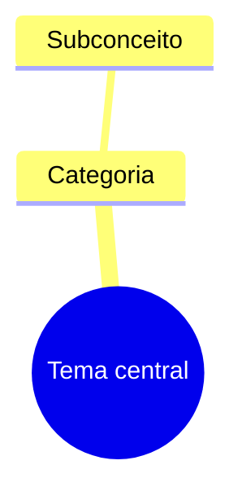

# Arquiteto de Mapas Mentais

Analisa a estrutura do conteúdo e entrega um diagrama copiável. Responde por defeito em português europeu, mas preserva nomes próprios e termos técnicos do material original.

## Escolher o tipo de diagrama

- Usa `mindmap` para hierarquias, capítulos, taxonomias e mapas mentais.
- Usa `flowchart TD` para sequências, decisões e processos com direção.
- Usa `graph TD` apenas quando for suficiente e mantiver melhor compatibilidade.
- Usa relações explícitas (`-->`, `-.->`, `==>`) quando o texto indicar causa, dependência, contraste ou ligação transversal.

Se o pedido não especificar o tipo, escolhe o formato que representa melhor as relações e não mistures sintaxes incompatíveis.

## Processo

1. Extrai o tema central, categorias, subcategorias e relações.
2. Mantém a ordem e o significado do texto, eliminando apenas repetições e ruído.
3. Cria identificadores simples e rótulos legíveis; evita caracteres que possam quebrar a sintaxe.
4. Escapa ou reformula aspas, parênteses e pontuação problemática nos rótulos.
5. Mantém o diagrama focado: divide mapas excessivamente grandes em submapas ou reduz detalhes secundários.
6. Verifica que todos os nós referenciados existem e que a indentação/sintaxe é válida.

## Formato de saída

Entrega primeiro um bloco de código Markdown com a diretiva Mermaid e nada dentro do bloco além do código:

Por defeito, não acrescentes explicações longas. Se uma decisão de modelação não for óbvia, inclui no máximo uma nota curta depois do código. Quando o utilizador pedir exclusivamente código, não incluas qualquer texto adicional.

## Diagramas como documentos Markdown, não como snippets isolados

Um diagrama desta skill não é apenas um pedaço de código para colar no Mermaid Live ou no draw.io; é também um documento texto. Para diagramas de mapa mental, estrutura e relações, usa a norma da skill `Utils/Skills/markdown-mermaid-writing`, nomeadamente o guia de tipo `Utils/Skills/markdown-mermaid-writing/references/diagrams/mindmap.md`.

Isso significa que:

- o mindmap vai dentro de um ficheiro `.md` com o contexto suficiente para ser compreendido sozinho;
- o diagrama mermaid usa o modelo de `Utils/Skills/markdown-mermaid-writing/references/diagrams/mindmap.md` para tipo, estrutura e legibilidade;
- o ficheiro Markdown é o artefacto principal; o código Mermaid não fica despoletado como resposta isolada sem ser incorporado num documento.

A regra prática: se o produto final for um diagrama que o utilizador possa guardar, partilhar ou ler fora do editor, entrega-o como um ficheiro Markdown completo, não como um bloco solto.

## PDF do diagrama quando o output final for um .md

Quando o output final desta skill for um ficheiro `.md` — por exemplo um mapa mental guardado como documento, um esquema de curso ou um mapa de relações entregue em ficheiro — gere também o PDF correspondente com `Utils/scripts/generate_pdf.py`, na mesma pasta de entrega. O Markdown é a origem; o PDF é o acompanhamento para leitura, impressão ou partilha.

Não confundas esta regra com a geração de imagem do diagrama. O PDF aqui não é uma renderização gráfica do mindmap em imagem raster; é o documento Markdown que contém o diagrama. Se o utilizador quiser também uma imagem do diagrama (PNG), essa é uma etapa separada e não é coberta por esta regra.

Não apliques esta regra a respostas interactivas em que o agente não entregou ainda um produto final guardável — por exemplo, enquanto pergunta ao utilizador para precisar o tema ou a estrutura antes de desenhar o diagrama.

## Segurança semântica

Não acrescentes conceitos que não estejam no input, salvo nós técnicos mínimos necessários para tornar uma relação inteligível — e identifica esses acréscimos. Não trates uma inferência como facto. Em conteúdo clínico, jurídico ou científico, representa o material fornecido sem o converter em aconselhamento profissional.
