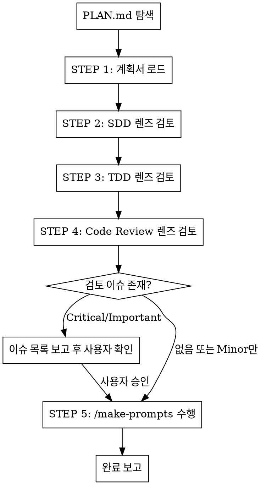

# spp-make-prompts

## Overview

PLAN.md를 superpowers 실행 단계 관점으로 검토한 뒤 `/make-prompts`를 수행한다.

**핵심 원칙:** 프롬프트 생성 전 계획서 품질을 superpowers 실행 워크플로우 기준으로 검증한다. 미검증 계획서에서 생성된 프롬프트는 실행 단계에서 반복 수정을 야기한다.

## 전제 조건

1. `docs/superpowers/plans/` 경로에 PLAN.md 또는 `*plan*.md` 파일 존재
2. 파일이 없으면 즉시 중단:
   ```
   실행 불가: PLAN.md 없음. Plan Mode 먼저 수행 후 재시도.
   ```

## 실행 흐름



## STEP 1: 계획서 로드

탐색 우선순위:
1. `docs/superpowers/plans/` — 가장 최근 수정된 파일 우선
2. 프로젝트 루트의 `PLAN.md`
3. `*plan*.md` 패턴 파일

로드 후 추출할 항목:
- Global Constraints
- Architecture / Tech Stack
- 태스크 목록 및 의존성
- 파일 경로 및 인터페이스 명세

## STEP 2: SDD 렌즈 검토

`superpowers:subagent-driven-development` 기준으로 각 태스크 검토.

| 검토 항목 | 기준 | 이슈 등급 |
|---------|------|---------|
| 태스크 독립성 | 파일 겹침, 공유 상태 없음 | Critical |
| 태스크 단일 책임 | 목표 하나, 대상 명확 | Important |
| placeholder 없음 | TBD/TODO/나중에 없음 | Critical |
| 인터페이스 명세 완결성 | 이전 태스크 인터페이스 명시 | Important |
| 완료 기준 존재 | 각 태스크에 검증 조건 | Important |
| 의존성 그래프 일관성 | 순환 의존 없음 | Critical |

## STEP 3: TDD 렌즈 검토

`superpowers:test-driven-development` 기준으로 검토.

| 검토 항목 | 기준 | 이슈 등급 |
|---------|------|---------|
| 테스트 파일 경로 명시 | 각 태스크에 테스트 대상 포함 | Important |
| 실행 명령어 명시 | 테스트 실행 방법 포함 | Important |
| RED 조건 서술 가능성 | 실패 조건 추론 가능 | Minor |
| 테스트 범위 적절성 | 완료 기준이 테스트로 검증 가능 | Important |

## STEP 4: Code Review 렌즈 검토

`superpowers:requesting-code-review` 기준으로 검토.

| 검토 항목 | 기준 | 이슈 등급 |
|---------|------|---------|
| Global Constraints 명시 | 리뷰어에 전달 가능한 제약 존재 | Important |
| 보안/인증 태스크 식별 | 고위험 모듈 여부 표시 | Minor |
| 태스크별 커밋 경계 | 리뷰 패키지 생성 가능한 단위 | Minor |

## STEP 5: /make-prompts 수행

검토 완료 후 `/make-prompts` 커맨드를 실행한다.

**전달 컨텍스트:**
- 검토에서 확인된 태스크 구조 (단계 분해 기준으로 활용)
- superpowers 워크플로우 고려사항:
  - 각 태스크 프롬프트에 `완료 기준` 포함
  - 의존성이 있는 태스크는 별도 단계로 분리
  - 병렬 가능 태스크는 병렬 단계로 표시
  - 각 단계 프롬프트에 대상 파일 경로 명시

**`/make-prompts` 동작은 해당 커맨드의 절차를 따른다.**
이 스킬은 입력 품질 보증만 담당하며 프롬프트 생성 로직을 재구현하지 않는다.

## 완료 보고

```
## spp-make-prompts 완료

계획서: {파일 경로}
검토 결과:
  🔴 Critical: N건 (처리됨 / 사용자 승인)
  🟡 Important: N건 (처리됨 / 사용자 승인)
  🔵 Minor: N건 (기록됨)

/make-prompts 실행 완료:
  → to_do_prompts/{feature_name}_prompts/{파일 목록}
```

## 금지 사항

- Critical 이슈 존재 시 사용자 확인 없이 `/make-prompts` 진행 금지
- PLAN.md 내용을 이 스킬이 직접 수정하지 않음 (보고만)
- `/make-prompts` 동작 로직 재구현 금지 — 해당 커맨드에 위임
- 계획서 없이 스킬 진행 금지

## Common Mistakes

| 실수 | 수정 방법 |
|------|---------|
| 검토 없이 바로 `/make-prompts` 실행 | STEP 2~4 검토 후 진행 |
| Critical 이슈 무시하고 진행 | 사용자 확인 후 진행 여부 결정 |
| 가장 오래된 PLAN.md 로드 | 가장 최근 수정 파일 우선 |
| `/make-prompts` 로직 인라인 재구현 | 해당 커맨드에 위임 |
