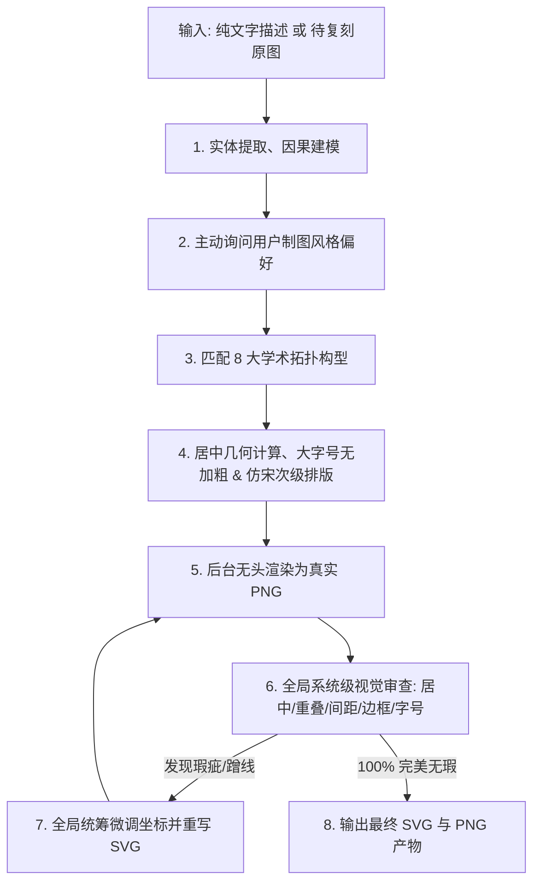

# 社科学术机制图矢量设计引擎

本技能按顶级学术期刊出版标准（CSSCI / SSCI）自动构建、复刻与自检**社科学术机制图**（理论机制图、分析框架图、演进模型、政策网络、治理体系）的纯矢量 SVG。

**核心能力**：
- **纯文本驱动出图**：输入一段文字、理论假说或机制描述，自动解析概念与因果逻辑、匹配拓扑构型并生成标准矢量 SVG；
- **原图复刻**：输入现有机制图，按其拓扑结构重新绘制为高规格 SVG；
- **风格前置询问**：出图前**主动询问用户制图风格偏好**，而非擅自替用户决定（见"一、出图前主动询问制图风格"）；
- **强制自检闭环**：生成 SVG 后必须在后台无头渲染为真实 PNG 进行视觉审查，发现瑕疵必须自主修改代码并重新检查，直至 100% 无误方可输出。

## 路径约定

本文件中的相对路径默认相对本 skill 根目录解析：
- `references/`：绘图参考大全（8 大构型几何参数与文本转译指南、矢量设计系统、拓扑分类名录）
- `scripts/`：无头渲染器与批量转化器
- `examples/`：成品机制图 SVG 样例（复刻风格参考）

## 核心工作流（Text-to-Diagram Workflow）



## 一、出图前主动询问制图风格（必做交互）

**本技能要求在真正落笔出图前，主动向用户询问制图风格偏好**，把关键风格选择权交还给用户，而不是静默替用户决定。这是让图表贴合用户预期、避免返工的关键步骤，也是本技能的核心交互协议。

### 1. 询问方式（按运行环境适配）

* **在 Claude Code 中**：使用 `AskUserQuestion` 工具发起**一次**结构化询问，同时提出 2~4 个问题（工具限制单次最多 4 问），每个问题给出 2~4 个清晰选项；
* **在 Codex 等其他 Agent 中**：以简洁的自然语言在对话中一次性确认下列问题（不分多次追问，避免打断）；
* **若用户已主动给出风格偏好**（如"要实线外框、虚实结合"或直接给了一张风格参考图）：跳过询问，直接采用，并在产出说明中复述所采用的偏好。

### 2. 建议询问项

1. **拓扑构型流派**：选项建议
   * 自动匹配（AI 依据文本语义匹配 8 大经典拓扑之一）
   * 指定构型（如：多主体网络 / 分层治理 / 因果链条 / 环形回路 / 对偶模型…详见 `references/drawing_patterns_reference.md`）
2. **外围大边框样式 (Outer Frame Style)**：
   * `实线大外框`：经典出版风，清晰界定系统边界（`<rect stroke="#000000" stroke-width="1.8" fill="none" />`）；
   * `虚线大外框`：开放式环境/制度系统边界（`<rect stroke="#000000" stroke-width="1.8" stroke-dasharray="8 6" fill="none" />`）；
   * `无外围边框 (开放式画布)`：现代极简呼吸风，直接以纯白画布为底，图表主体居中展开。
3. **分箱与连线风格 (Line Style Preference)**：
   * `实线为主`：干练权威；
   * `虚实结合`：核心实体用实线，辅助路径/反馈回路/分区分箱用虚线。

### 3. 询问后的决策纪律

* 用户做出的选择**必须优先于**任何自动推断；
* 用户未回答的项：按文本语义自动匹配最优项，并在交付说明中列出"自动推断项 + 依据"，供用户事后调整；
* 若用户回复"你决定 / 随便 / 按默认"：按文本语义自动匹配，但仍须在产出说明中**明确告知采用了哪些风格及其理由**，并提示可一键重出。

---

## 二、不可逾越的制图红线与排版规范 (Immutable Design Rules)

### 1. 绝对禁止图表标题与边角注释
* 严禁在图内包含任何主标题（如"图1 XXX机制图"），留给作者在论文正文排版中手写；
* 严禁出现"作者自制"、"数据来源"等辅助说明。

### 2. 字体栈与层级排版规范 (HeiTi & Bold FangSong)
* **核心强调项：标准黑体 (HeiTi)，不强制加粗，通过大字号突出**：
  * 主模块/核心概念/关键标题（强调项）：采用黑体，**不强制加粗 (`font-weight="normal"`)**，仅通过放大字号（`20px ~ 24px`）实现层级区分；
  * 字体栈：`'SimHei', 'Heiti SC', 'Microsoft YaHei', sans-serif`；
* **次级非强调项：加粗仿宋体 (Bold FangSong)**：
  * 次级节点、括号指标、连线说明、细分参数（非强调项）：采用**加粗仿宋体 (`font-weight="bold"`)**，字号 `14px ~ 16px`；
  * 字体栈：`'FangSong', 'STFangsong', 'FangSong_GB2312', 'SimSun', serif`；
  * 英文/数字：`'Times New Roman', 'Arial', sans-serif`。

### 3. 严格纯粹白底黑字规范 (Strict Pure Black & White)
* **绝对禁用任何彩色与灰色/深色背景**：
  * 严禁使用深色/黑色背景块（严禁文字反白）；
  * 严禁使用浅灰色底色填充（如 `#f5f5f5`, `#eeeeee`, `#333333` 全部废弃）；
  * 所有图形容器/卡片填充：统一为**纯白** `fill="#ffffff"` 或透明 `fill="none"`；
  * 所有文本颜色：统一为**纯黑** `fill="#000000"`；
  * 所有线条与边框：统一为**纯黑** `stroke="#000000"`。

### 4. 动态自适应固定画布与绝对居中 (Dynamic Sizing & Fixed Viewport)
* **动态按需计算画布尺寸，严禁写死单一比例**：画布尺寸 `(W, H)` 必须根据信息量、层级数与拓扑流向动态计算，防止内容过多时拥挤变形：
  1. **标准 3:2 画布 (`900 x 600`)**：适用于常规 4~6 节点的动力学、网络或对偶模型；
  2. **大型三元/多元综合治理架构 (`1320 x 720`)**：适用于"左困境/起点 + 中部复合机制体系 + 右产出/效能 + 底部反馈回路"的顶刊宏大分析框架（左215px、中590px、右215px、两走廊各80px）；
  3. **宽幅长时序因果链 (`1200 x 650` ~ `1400 x 750`)**：适用于 5~7 阶段的长流程横向流水线；
  4. **纵向深层级架构 (`900 x 1000` ~ `1000 x 1200`)**：适用于 4~6 层自上而下的宏-中-微观纵向大框架；
  5. **正方环形网络 (`800 x 800` ~ `900 x 900`)**：适用于正多边形主体网络、同心圆或矩阵模型。
* **物理像素与视口严格 1:1 绑定（防止偏左上角）**：
  * 计算出 `W` 和 `H` 后，SVG 根标签必须严格声明：`<svg xmlns="http://www.w3.org/2000/svg" viewBox="0 0 {W} {H}" width="{W}" height="{H}">`；
  * **严禁使用 `width="100%" height="100%"`**，确保物理宽度与 viewBox 绝对一致，杜绝视口拉伸死白。
* **四向对称留白计算公式**：
  * 外大边框：`<rect x="{P}" y="{P}" width="{W - 2*P}" height="{H - 2*P}" rx="8" />`（外边距 `P = 40px`）；
  * 几何中心：所有核心节点必须以 `(W / 2, H / 2)` 为基准对齐居中展开。

### 5. 严格曲线净空与防重叠 (Clearance Rule)
* 跨实体的全局演进曲线/反馈回路，其轨迹与下方所有卡片顶点**必须保持至少 `35px ~ 50px` 的安全净空高度**，严禁切割文字或穿透卡片；
* 阶段阶梯间传导必须使用阶梯正交折线（`M x1 y1 L x2 y1 L x2 y2 L x3 y2`）精确对接边缘。

### 6. 文字与图形元素黄金间距规范 (Text-to-Element Spacing)
* **卡片内文字边距**：文字离卡片上下左右边界保持 `12px ~ 20px`（严禁贴边 <8px，严禁空旷 >30px）；
* **水平连线说明文字间距**：水平连线文字离对应线条保持 `8px ~ 12px` 垂直距离；
* **斜线与曲线上方标注文字净空 (Slope Clearance)**：在倾斜线条或上升/下凹曲线（如 S-Curve）上方标注文字时，由于斜率变化，必须以**文字包围盒最接近曲线的拐角**为基准，确保文字任意像素点与曲线保持至少 `25px ~ 40px` 的清晰安全净空，严禁文字末端或边缘蹭线/贴线；
* **多行文本行距**：主副标题或指标多行文本垂直行距严格保持在 `22px ~ 28px`。

### 7. 元素与元素实体间黄金间隙规范 (Inter-Element Clearance)
* **严禁图形紧贴挤压**：任何相邻的卡片、圆形节点、分箱之间**必须保留 `20px ~ 45px` 的物理空隙**：
  * 严禁两个圆形/齿轮外环直接相切或与中间卡片边缘贴合（必须预留 ≥25px 间隙并通过独立箭头连接）；
  * 水平并列卡片间距保持在 `30px ~ 45px`；
  * 分箱容器外框与内部子卡片四周必须留出至少 `20px` 的衬垫留白；
  * **外大边框安全呼吸带**：外层大边框与内部所有文本（如坐标轴顶端标签）及图形之间，**必须预留至少 `35px ~ 45px` 的外围安全留白**，严禁文字或箭头贴近外边框（<25px）。

### 8. 系统与全局空间分层预算红线 (Holistic Spatial Budgeting)
* **严禁"头痛医头、脚痛医脚"的局部微调**：
  * 复杂阶梯/演进模型必须严格划分为互不干涉的水平高度带（顶部趋势带、中部实体带、底部基线带）；
  * 调整任一元素必须整体联动下移/上移所有关联卡片、连接线与基线，确保画面间隙同步满足黄金标准。

### 9. 连线侧边标注显式对齐铁律 (Explicit Text-Anchor for Parallel Flows)
* **严禁在竖直/倾斜连线两侧使用默认居中 (`text-anchor="middle"`)**：
  * **左侧文本**：必须显式声明 `text-anchor="end"`，且 X 坐标距离连线保留 ≥12px 安全间隙（如"执行反馈"、"支持"、"资金"、"成果"）；
  * **右侧文本**：必须显式声明 `text-anchor="start"`，且 X 坐标距离连线保留 ≥12px 安全间隙（如"资源导入"、"响应"、"支持"、"生产"）；
  * 彻底消除因汉字字宽导致文本直接骑压、穿透指示箭头的严重排版事故。

### 10. 跨层纵向实体呼吸间距铁律
* 两个纵向排列的实体卡片之间，若存在双向连接箭头与标注文本：
  * 实体卡片之间的**物理纵向净空严禁 < 70px**；
  * 箭头起点与终点距离卡片上下边框必须保留 `6px ~ 8px` 安全衬垫，严禁箭头尖端撞击或穿透卡片边框。

### 11. 跨系统长连接线与分箱边界走廊铁律 (Cross-System Link Corridor)
* **连线完整性**：跨系统连接线必须完整从"源实体边缘"延伸至"目标系统边界"，严禁空中悬空断线；
* **文字避让安全走廊**：跨系统标注文字必须位于两系统物理间隙的**正中空旷走廊**，**文字边界距离任何容器分箱边界必须保持 ≥ 35px 的安全距离**，严禁文字被容器虚线/实线横切穿透。

### 12. 箭头起点零三角铁律与双向交互双线规范 (Zero Marker-Start Rule)
* **起点平整干净，严禁倒刺三角**：
  * 所有单向连线**仅允许在终点附加 `marker-end="url(#arrow)"`**，**严禁在起点声明 `marker-start`**；
  * 箭头的起点（流出方）必须是平整光滑的纯净线段端点，杜绝出现箭头倒刺撞击或骑在发射框体边线上的恶劣现象。
* **双向交互规范 (Dual Parallel Lines)**：
  * 若两个实体之间存在双向互动/反馈（如"支持 / 响应"、"合作交易 / 利益冲突"），**必须使用两条独立的平行单向箭头线**（一条从 A 指向 B，一条从 B 指向 A），各自在终点带单个箭头，文字左右分列。

### 13. 左右双系统/复合架构全域配平法则 (Dual-System Horizontal Balancing)
* **严禁局部单独对齐导致整体偏右/偏左**：
  * 当机制图包含"左侧流程容器 + 右侧治理网络"等复合双系统时，必须使用**全域包围盒配平公式**：
    `Margin_Left = X_LeftContainer - X_FrameLeft ≈ 40px`
    `Margin_Right = X_FrameRight - X_RightMostNode ≈ 40px`
  * 左右两系统的外边缘距离外边框的距离必须严格相等（±5px 误差内）；
  * 内部纵向主轴必须分别对齐各自子系统的几何中心线（如左系统脊柱 X=280，右系统脊柱 X=830），确保双系统内部与外部皆呈现极致对称。

### 14. 文本包围盒与容器边界安全验算铁律 (Text Bounding-box vs Container Width Formula)
* **防长文本穿透与溢出公式**：
  * 设文本包含 N 个中文字符，字号为 S px，文本物理宽度约为 `W_text ≈ N × S`；
  * 若置于宽度为 `W_container` 的卡片内居中排版，必须强制满足：`W_text + 2 × Padding_safe ≤ W_container`（其中 `Padding_safe ≥ 25px`）。
* **实战红线**：
  1. 若长标题字符数 ≥ 30 字（如"复合主体：基层政府（政策授权/动员） + 企业平台（运营载体/市场供给）"），字号严禁 ≥ 16px（宽 600px+ 必横切卡片），必须降为 `13.5px ~ 14px` 或折行；
  2. 卡片内列举条目每行中文字数超过 12 字时，卡片宽度必须预留 ≥ 200px，或精简至 8~10 字短语。

### 15. XML/SVG 语法与代码字符串转义避坑铁律 (XML/SVG Syntax & Escaping Rule)
* **严禁在 SVG 注释中出现双减号 `--`**：XML 语法严格禁止注释内容中包含 `--`（如 `<!-- --- Card 1 --- -->`），否则 Chrome/Firefox XML 解析器会直接触发 `Double hyphen within comment` 语法错误导致整图无法渲染；注释一律使用等号或单破折号（如 `<!-- === Card 1 === -->`）；
* **转义符与特殊字符安全规范**：
  * 在代码生成 SVG 字符串时，严禁使用未声明为原始字符串（`r'...'`）的反斜杠符号（如 `\rightarrow` 会被 Python 转义为 `\r` 回车符导致输出乱码）；
  * 连线与说明一律采用原生 Unicode 符号（如 `→`, `·`, `〔 〕`, `①`）或规范实体编码。

### 16. 跨层级/跨系统连线禁止穿越容器标题徽标与边框铁律 (Cross-Container Boundary & Badge Zero-Penetration Rule)
* **严禁连线穿刺标题徽标 (Zero Badge Piercing)**：
  * 当目标容器顶部设有居中或偏置的标题药丸/徽章（`[X_min, X_max] × [Y_min, Y_max]`）时，从上方引出的所有连接线**绝对禁止贯穿该徽章矩形及内部文本**（严禁垂直连线直接横切标题中文字符）。
* **端点精准停靠规范 (Boundary Docking Protocol)**：
  1. **系统级宏观映射 (System-to-System Mapping)**：跨层连接线终点必须精确停靠在**目标容器的外边框顶部**（`Y_end = Y_container_top - 2px`），或者在**标题徽标外侧的走廊区域**（`X < X_badge_min - 20px` 或 `X > X_badge_max + 20px`）下行停靠，严禁直接扎入容器内部！
  2. **子实体级精确传导 (Sub-Element Direct Flow)**：若必须连接至容器内部特定子卡片，连接线必须从**标题徽标两侧空旷走廊下行**，或使用**正交直角折线 (`M X1 Y1 L X1 Y_mid L X2 Y_mid L X2 Y2`)** 绕开标题区域，杜绝在中轴线上直线硬穿！
* **SVG 图层绘制顺序与底层遮罩防御 (DOM Paint Order & White Mask)**：
  * SVG 无 CSS z-index，后声明的元素会覆盖先声明的元素。所有连接线必须在 DOM 树中**置于目标卡片、文字与徽标之前声明**，确保实体卡片与徽章白底（`fill="#ffffff"`）能天然遮罩底层线条；
  * **核心底线是几何坐标上彻底杜绝线段与文本包围盒发生交叉碰撞**。

---

## 三、强制执行协议：出图后循环自检修复 (Mandatory Verification Loop)

无论是文本出图还是复刻原图，**生成代码后绝对不能直接退出**，必须在后台严格执行以下闭环：

```text
[生成初版 SVG]
      │
      ▼
[调用 scripts/render_svg.py 渲染为真实 PNG]
      │
      ▼
[视觉审查 PNG 图像] ──── 全局系统级检查清单:
      │                   1. 整体是否绝对居中？四周留白是否对称？
      │                   2. 全局空间分层是否清晰？（顶部趋势带、中部实体带、底部基线带互不侵犯）
      │                   3. 贝塞尔曲线/直线是否切割了任何文字？是否与卡片上边缘紧贴（<30px）？
      │                   4. 跨层/跨容器连线是否穿透了目标容器的标题徽标、边框或文本？（端点是否精准停靠外缘？）
      │                   5. 斜线/曲线上方文字是否蹭线？（拐角净空 ≥25px）
      │                   6. 字与图形元素的间距是否舒适？（不贴边 <8px，不脱节 >20px）
      │                   7. 元素与元素之间是否有适度空隙？（严禁硬性相切/贴合挤压，留白 20-45px）
      │                   8. 外大边框四周是否有 ≥35px 安全呼吸带？
      │                   9. 是否误入了图表标题或作者注释？是否存在灰色底块？
      │                   10. 字体与字号：强调项字号大且不加粗，次级项是否为仿宋？（字号 ≥14px）
      │
      ├─── [发现任何瑕疵] ──► [全局统筹联动修改坐标，重写 SVG] ──► (重新回到渲染自查)
      │
      └─── [100% 完美无瑕] ──► [输出最终 SVG 与 PNG，任务完成]
```

---

## 四、核心参考文档与内置工具 (Resources & Tooling)

* **绘图参考大全**：`references/drawing_patterns_reference.md`（100+ 张原图提炼出的 8 大构型几何参数与文本转译指南）
* **矢量设计系统**：`references/design_system.md`（坐标规范、组件库、防穿透曲线数学公式）
* **拓扑分类名录**：`references/layout_catalog.md`（全量初筛动态提炼协议）
* **无头渲染器**：`scripts/render_svg.py`（Selenium 无头 Chrome 将 SVG 像素级转换为 PNG；用法 `python scripts/render_svg.py <input.svg> <output.png>`）
* **批量转化器**：`scripts/batch_process_images.py`（全自动图集批量复刻与自检编排）
* **成品样例**：`examples/`（8 个 CSSCI/SSCI 风格机制图 SVG，复刻与询问风格参考时使用）
