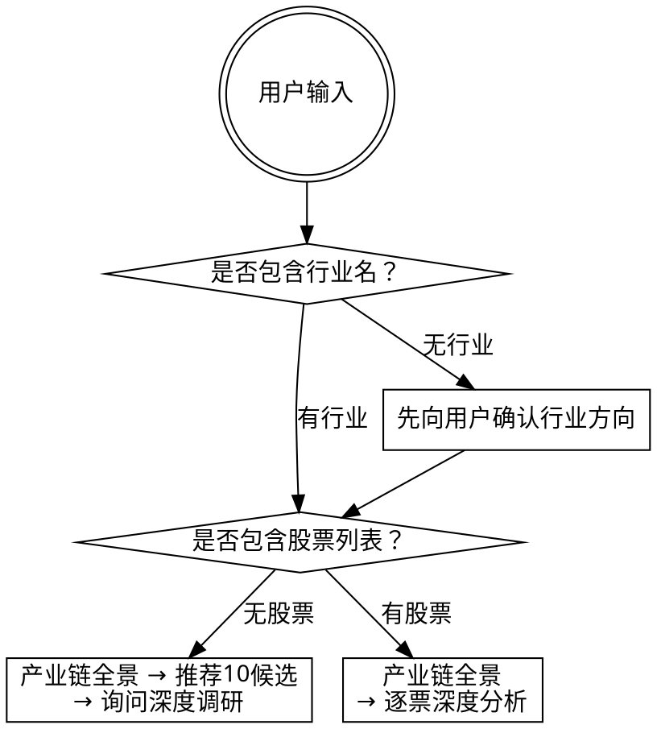
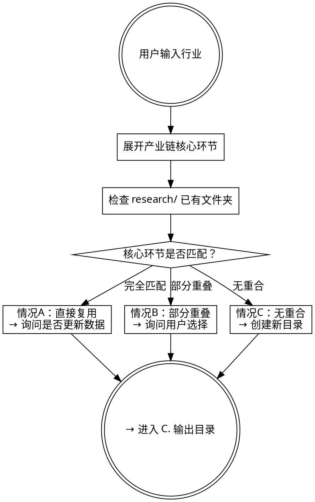

# 供应链瓶颈猎手

## 核心定位

沿着供应链往上游追溯，找到那个供应商极少、切换成本极高、产能扩张受限的环节——一旦供应紧张，下游将面临严重的成本压力和扩产制约。越往上游、越专业化，该环节就越难被非专业投资者理解和定价，这为深入研究创造了信息优势的空间。

这是一个纯产业链与公司基本面研究框架：拆解供应链 → 找到瓶颈环节 → 识别A股标的 → 用标准化判据评分 → 给出有证据支撑的判断。

## 适用场景

**触发场景：**
- 用户要求分析某个行业的产业链/供应链结构
- 用户要求寻找"卡脖子"环节或不可替代的上游供应商
- 用户提供一组A股股票，要求从产业链角度做基本面研究
- 用户提到"产业链""瓶颈""卡脖子""国产替代""供应链分析""供应链安全""国产化率"等关键词
- 用户希望识别尚未被市场充分定价、份额确定性高的公司

**不适用场景：**
- 短期交易分析、技术面分析、资金流向分析
- 纯美股/港股标的筛选（候选池仅覆盖A股）
- 纯软件/纯服务行业（无实体供应链，方法论不适用）
- 用户只需行情数据或简单财务查询（应使用 tushare-data 技能）
- 不做买卖建议、不判多空方向、不涉及交易面（仓位/止损/择时）

## 前置条件

- Tushare token 已配置（环境变量 `TUSHARE_TOKEN`）
- Python 3.x + `pip install tushare pandas scipy`
- 脚本命令需在 skill 根目录下执行
- Tushare `balancesheet` 接口需 ≥2000 积分（不足时自动跳过并标注 `[数据不可得]`）

## 术语表

本框架使用以下自查术语，在本框架内有特定含义：

| 术语 | 定义 |
|------|------|
| **瓶颈** | 产业链中供应商极少、切换成本高、产能扩张周期长、下游不可替代的环节（结合BOM占比和政策/地缘壁垒综合判定） |
| **供需结构判定** | 分别回答"是否存在供应瓶颈"和"行业是否处于供需扩张"两个独立问题，产生 2×2 四种场景 |
| **核心判据** | 对候选标的进行 1-5 分评分的 12 条标准化标准 |
| **红旗** | 需要格外谨慎的 16 条风险信号，触碰一条不代表不值得研究，但须在报告中重点讨论 |
| **持续性评估** | 对瓶颈环节的时间维度分析：预计持续时间、生命周期阶段、打破瓶颈的触发因素 |
| **多需求源共振** | 两个或更多独立需求来源同时涌向同一批上游材料，形成需求端的 N 重加强 |
| **场景迁移** | 供需结构判定结果在四种场景间的动态切换，由政策、产能、替代技术等因素触发 |
| **ROIC-WACC 利差** | 公司每投入 100 元资本赚回来的钱，减去这 100 元的融资成本。差值为正且扩大→竞争优势在加强；为负→在毁灭股东价值。是量化护城河的核心指标 |
| **波特五力速查** | 用供应商、买方、新进入者、替代品、竞争者五个维度交叉验证瓶颈质量 |
| **利润池分析** | 分析超额利润在价值链哪个环节沉淀——瓶颈环节≠利润池沉淀环节。从超额利润分布、BOM占比弹性、专属vs普涨、利润弹性差值四个维度定位真正的利润集中点 |
| **证据分级** | 每个关键结论标注来源等级：已证实/较强/线索/推断 |
| **精度降级** | 关键假设存在[推断]时禁止输出精确百分比，只能输出方向+量级 |
| **申万行业分类** | 申银万国证券研究所发布的 A 股行业分类标准，分三级（如"电子→半导体→集成电路"），是本框架中同行对比的基准分类体系 |
| **BOM** | 物料清单（Bill of Materials） |
| **SAM / TAM** | TAM = 全行业终端市场规模；SAM = 公司产品可服务的市场空间 |
| **FCF / OCF / CAPEX** | FCF = 自由现金流；OCF = 经营现金流；CAPEX = 资本支出 |
| **S 曲线** | 技术生命周期曲线（萌芽→加速→成熟） |
| **OSINT** | 开源情报（Open Source Intelligence） |

---

## 前置步骤

在进入 12 步主流程之前，必须完成以下三项前置操作。

### A. 输入路由

用户的输入决定研究路径。行业是必选项，股票列表是可选项。

**路由规则：**

1. **包含行业名（有或无股票列表）：**
   - 先执行 B. 研究去重
   - 有行业 + 有股票 → 进入 Step 1（产业链全景 → 逐票深度分析）
   - 有行业 + 无股票 → 进入 Step 1（产业链全景 → 推荐 10 候选）→ **🛑 必须询问用户是否对这些标的做深度调研。收到用户明确确认（或新股票列表）之后，方可进入 Step 9。**

2. **只有股票，没有行业：**
   - **🛑 先向用户确认这些股票属于哪个行业方向。收到用户明确回复之后，方可继续。**
   - 确认后按"行业+股票"路径继续



**默认候选筛选规则：** 当用户仅提供行业名时，在产业链各瓶颈环节的资料搜索中，取每个环节被提及频率最高、券商研报覆盖最密集的公司，按瓶颈强度排序，总数控制在 10 家左右。

### B. 研究去重

创建新研究文件夹之前，必须先将用户输入的行业名展开为具体产业链描述，再检查 `research/` 下是否已有相同或相似行业的研究。

**前置操作——行业名→产业链展开：**
- 如"光伏" → 列出核心环节：硅料→硅片→电池片→组件→逆变器→电站
- 如"人形机器人" → 列出核心环节：丝杠→减速器→电机→传感器→控制器→整机
- 基于产业链环节做去重匹配，而非基于行业名称字符串匹配



**检查步骤：**

1. 列出 `research/` 下所有已有文件夹，读取每个文件夹的 `outputs/industry-map.md`（如果存在）
2. 对比用户输入的行业与已有研究的行业名
3. 根据匹配程度采取不同行动：

**情况A：明确是同一行业（直接复用）**

命名虽有差异，但从产业链核心环节判断明显是同一行业。直接复用已有文件夹，不创建新目录。

| 典型示例 | 已有文件夹 | 用户输入 | 判断理由 |
|---------|-----------|---------|---------|
| 翻译差异 | `robotics` | 机器人 | 中文直译，核心产业链完全相同 |
| 简称/全称 | `humanoid-robot` | 人形机器人 | 同一事物的不同叫法 |
| 拼音/英文 | `guangfuxiabianqi` | 光伏逆变器 | 同一中文词的英文翻译 |
| 简写 | `pv` | 光伏 | PV=photovoltaic=光伏，业内通用简写 |

**情况B：疑似相关但可能是不同细分（询问用户）**

两个行业共享部分产业链环节，但覆盖范围或研究侧重可能不同。

| 典型示例 | 已有文件夹 | 用户输入 | 为什么询问 |
|---------|-----------|---------|---------|
| 上下游关系 | `guangmokuai`（光模块） | 光芯片 | 光芯片是光模块的上游零部件，可能是独立研究方向 |
| 大行业 vs 子行业 | `xinnengyuan`（新能源） | 光伏 | 光伏是新能源的子行业，研究范围差异很大 |
| 交叉领域 | `rengongzhineng`（人工智能） | 机器人 | AI和机器人有交叉但产业链不同 |

**询问话术模板：**
> 发现已有 `{已有文件夹}` 的研究，覆盖了 {已有研究的核心环节}。你输入的"{用户行业名}"属于 {关系描述}。
> - 选项1：在已有研究基础上迭代（数据更新到最新、扩展产业链覆盖）
> - 选项2：创建独立的新研究（{用户行业名}的核心差异在于……）

**情况C：完全不同（创建新目录）**

`research/` 中所有已有研究与用户输入的行业在产业链核心环节上没有重合。

**复用时的后续动作：**

当决定复用已有文件夹时，必须询问用户：
> 已有研究的数据截止日期为 `{最后更新日期}`。是否需要将行情数据与财务数据更新到最新日期？

### C. 输出目录

每次研究开始前：

1. 向用户确认输出目录，默认使用当前对话的工作目录
2. 在该目录下创建 `research/{行业英文名}/` 文件夹
3. 行业文件夹命名使用英文/拼音，避免中文字符兼容问题（如 `humanoid-robot`、`pv-inverter`）
4. 后续该行业的所有研究产出均写入此目录

完成前置步骤后，进入 12 步主流程。

---

## 速查表

### 12步流程一览

| 步骤 | 做什么 | 输出文件 | 数据来源 |
|------|------|------|------|
| 1 | 拆解产业链全景 | `outputs/industry-map.md` | 网络搜索、研报、招股书 |
| 2 | 供需结构判定 → 四场景定位 | 写入 `outputs/industry-map.md` 末尾 | 基于 Step 1 |
| 3 | 定位瓶颈环节 | 写入 `outputs/industry-map.md` | 网络搜索、招股书、券商研报 |
| 4 | 利润池分析 | 写入 `outputs/industry-map.md` | 基于 Step 3 + 价格/BOM数据 |
| 5 | 拉取Tushare数据 | `inputs/auto/*.csv` | Tushare（必须） |
| 6 | 12条判据逐条评分 | `outputs/target-pool.md` | Tushare 返回的实际数据 |
| 7 | 16项红旗扫描 | 融入 `outputs/target-pool.md` | 年报+季报+行情数据 |
| 8 | 证据分级标注 | `outputs/target-pool.md`（判据依据列）、`outputs/deep-dives/{股票代码}.md`（各关键结论）、`outputs/industry-map.md`（数据来源列） | 年报/巨潮、行业会议/专利、招聘/合作伙伴等OSINT |
| 9 | 三档情景财务翻译 | `outputs/deep-dives/{股票代码}.md` | Tushare + 年报 |
| 10 | 白话综合判定 | `outputs/deep-dives/{股票代码}.md` | 综合以上所有 |
| 11 | 投研结论汇总 | `outputs/summary.md` | 综合 |
| 12 | 质量复核 | 融入各报告末尾 | 自查清单 |

### 四场景选股速查

| 场景 | 选股逻辑 | 评分侧重 | 重点判据 |
|------|---------|---------|------|
| [优先] 有瓶颈+在扩张 | 精挑"解扣子"的公司 | 侧重发展阶段与估值空间（瓶颈深度决定弹性） | 判据1/2/4/6/10 |
| [扩张] 无瓶颈+在扩张 | 找上游供给弹性最小的环节，放宽选股 | 侧重需求验证（景气节奏 > 壁垒深度） | 判据2/6/11/12 |
| [跟踪] 有瓶颈+未扩张 | 精挑能熬过寒冬的公司 | 侧重财务质量与估值安全边际（能活到需求来） | 判据5/9/10/11 |
| [排除] 无瓶颈+未扩张 | **暂停，告知用户：** 该行业既无结构性卡点也无周期顺风，不在本框架研究范围内。列出判定依据，询问用户是否仍要继续、或调整行业范围 | — | — |

## 执行红线

以下任何一条被违反，意味着本轮研究执行失效，必须停止并纠正后才能继续：

### 硬性停止（违反即停止）

- **在 Tushare 数据拉取完成之前进行判据评分** — 搜索引擎数据仅作线索，评分必须以 Tushare 返回值为准（Step 5 → Step 6 顺序不可颠倒）
- **用户未确认行业方向时进入 Step 1** — "只有股票无行业"场景下，必须先收到用户的行业确认回复
- **用户未确认深度调研时对推荐候选展开 Step 9-10** — "只有行业无股票"场景下，推荐候选后必须等待用户确认
- **在 [排除] 场景（无瓶颈+未扩张）下继续分析标的** — 必须暂停，告知用户该行业不在框架覆盖范围内

### 软性违规（发现即修正）

- **关键假设含 [推断] 但结论输出精确百分比** — 必须降级为方向+量级表述
- **跳过 Step 2 供需结构判定直接进入判据评分** — 场景定位决定所有后续选股逻辑
- **跳过 B. 研究去重直接创建新文件夹** — 必须先检查 `research/` 下已有研究
- **风险段落写在乐观情景之后** — 顺序不可颠倒

---

## 研究流程

每一步都产生结构化输出，写入当前工作目录下的 `research/{行业英文名}/outputs/`。

### Step 1：产业链全景图

从终端需求出发，逐层拆解到最上游的原材料，每层标注竞争格局、国产化率和瓶颈判断。

**数据来源：** 网络搜索、券商研报、招股书、行业协会数据。

输出文件：`outputs/industry-map.md`

如行业涉及重大政策/地缘因素（如半导体出口管制、光伏补贴、国产替代清单等），可额外产出 `policy-analysis.md`。

**偏误自检：** 产业链拆解是否受到了用户已有倾向的影响？核心环节是否有遗漏（尤其是用户未提及的方向）？

### Step 2：供需结构判定

回答两个独立问题：**①是否存在供应瓶颈？②行业是否处于供需扩张？** 答案排列组合产生四种场景：

|  | 有供应瓶颈 | 无供应瓶颈 |
|---|---|---|
| **在扩张** | [优先] 结构性卡点 + 景气顺风 | [扩张] 全面景气 |
| **未扩张** | [跟踪] 深价值跟踪 | [排除] 不在本框架覆盖范围内 |

每种场景的选股逻辑和研究侧重完全不同。**详细判定流程、四级→二分映射规则、多需求源共振检查、场景迁移监控、波特五力速查、判定输出格式模板，见 `references/methodology.md` 第一章。**

判定结论写入 `outputs/industry-map.md` 末尾。

**偏误自检：** 判定依据是否来自独立信息源？是否存在"用户提了某标的→倾向判定为有瓶颈"的逆向推导？

### Step 3：瓶颈定位

> **前置条件：** Step 2 判定结果不是 [排除]。如为 [排除]，流程已在 Step 2 终止，不进入此步。

对产业链各层做精细标注：标注瓶颈强度（强/中/弱），对强和中环节补充持续性评估（持续时间、生命周期阶段、最大威胁因素），技术驱动型环节做 S 曲线定位，用波特五力交叉验证。**详细方法见 `references/methodology.md` 第一章（波特五力速查）和第二章（瓶颈持续性评估）。**

### Step 4：利润池分析

瓶颈环节 ≠ 利润池沉淀环节——必须分析超额利润在价值链的哪一环节真正沉淀。从超额利润分布、BOM占比弹性、专属vs普涨、上下游利润弹性差值四个维度逐项分析。

**详细方法论和案例见 `references/methodology.md` 第三章。**

输出位置：`outputs/industry-map.md`，紧接 Step 3 瓶颈标注之后。

**偏误自检：** 是否默认了瓶颈环节就是利润池沉淀环节？利润池分析是否推翻了某个环节的瓶颈价值但未如实呈现？

### Step 5：数据核实

**在判据评分之前，必须运行 Tushare 脚本获取准确数据。** 网络搜索得到的市值、PE、营收增速仅作线索，最终数据以 Tushare 返回值为准。

```bash
python references/scripts/fetch_market_data.py "代码1,代码2,..." \
  --output-dir research/{行业英文名}/inputs/auto/
```

随后必须运行 fetch_wacc.py 获取 Beta、WACC 和同行相对排位：

```bash
python references/scripts/fetch_wacc.py "代码1,代码2,..." --rf 3.0 --erp 6.0 \
  --output-dir research/{行业英文名}/inputs/auto/
```

`fetch_market_data.py` 拉取最新行情、估值、财务指标并归档到 `inputs/auto/`；`fetch_wacc.py` 输出 Beta、WACC 和同行排位。两个脚本均为必须执行。详见 `references/data-sources.md`。

### Step 6：判据评分

对每个候选标的，用12条核心判据逐条打分（1-5分），汇总排名。评分使用 Tushare 返回的实际数据。

判据详见 `references/methodology.md` 第四章。输出文件：`outputs/target-pool.md`

**精度提醒：** 如某条判据的核心输入含 `[推断]` 或 `[推测]` 标注，该条评分后标注 `[精度受限]`。`outputs/target-pool.md` 排名汇总中需注明哪些结论受精度降级影响。精度降级规则详见 `references/evidence-rules.md` 第三章。

**偏误自检：** 逐票评分前，检查是否存在"用户提过的标的系统性偏高"或"用户未提的标的系统性偏低"的模式。如有，暂停并逐条写出加分依据是否来自一手源。

### Step 7：红旗扫描

对每个候选标的检查 16 项红旗（触碰一条即标出）。

**各红旗的详细判定标准（含精确阈值和子项）见 `references/methodology.md` 第五章。**

### Step 8：证据分级

每个关键结论标注证据等级（已证实 / 较强 / 线索 / 推断）。**详细规则见 `references/evidence-rules.md`。**

### Step 9：财务翻译

对每个深度标的构建 Base / Bull / Bear 三档情景。每档绑定具体假设，含 ROIC-WACC 利差方向、FCF 状态、适用估值方法。按最可能→最不可能排序并给出理由。

**如需补充最新单票数据：**
```bash
python references/scripts/fetch_stock_snapshot.py {股票代码}
```

精度降级逐档独立判断。估值方法选择与风险溢价差异化详见 `references/methodology.md` 第六章。

### Step 10：综合判定

用大白话给出结论：这家公司卡的是什么环节、这个环节为什么是瓶颈、竞争优势能持续多久、什么情况会推翻这个判断。

输出文件：`outputs/deep-dives/{股票代码}.md`

### Step 11：投研结论汇总

将所有深度分析标的的核心结论汇入一张总表，产出 `outputs/summary.md`，包含：
- 每家公司一句话定性（卡什么环节、瓶颈强度、核心风险）
- 评分排名总览
- 行业整体判断和关键跟踪指标

**增量补充检查清单：**

> 每次在对话中追加新标的/事件链后，必须逐项核对以下清单，**全部 ✅ 后才能宣布"更新完成"**。

| # | 检查项 | 影响文件 | 对应步骤 |
|:--:|------|------|:--:|
| 1 | 新标的深度分析是否已写入？ | `outputs/deep-dives/{股票代码}.md` | Step 9-10 |
| 2 | 新供应链环节是否已追加到产业链全景？ | `outputs/industry-map.md`「产业链分层」 | Step 1, 3 |
| 3 | 瓶颈排名 + 利润池是否已加入新环节？ | `outputs/industry-map.md` 各瓶颈条目 | Step 3, 4 |
| 4 | 新标的是否已加入判据评分排名表？ | `outputs/target-pool.md`「评分排名总览」+「逐票判据明细」 | Step 6 |
| 5 | 新标的是否已加入红旗扫描？ | `outputs/target-pool.md`「红旗标记」 | Step 7 |
| 6 | 投研汇总是否已更新？ | `outputs/summary.md` | Step 11 |
| 7 | 全池数量统计是否已更新？ | 各文件覆盖范围描述 | — |

### Step 12：质量复核

**每次产出文件时分别执行**：

- Step 6 产出 `outputs/target-pool.md`（涉及评分排序时）
- Step 10 产出 `outputs/deep-dives/{股票代码}.md`
- Step 11 产出 `outputs/summary.md`

每次对照5项复核清单自检。详见 `references/review-checklist.md`。
复核通过后在报告末尾注明；发现问题则先修正再输出。

---

## 常见错误

| 错误 | 正确做法 |
|------|---------|
| 看到供应商集中就认定是瓶颈 | 必须用波特五力交叉检查——替代品威胁和买方议价力可能削弱瓶颈价值 |
| 对不同瓶颈类型都给同一套估值 | 技术壁垒型可给较高PE，产能紧缺型需随扩产进度压缩，纯概念/认证期不适合传统估值 |
| 在无瓶颈+在扩张场景下精挑个股 | 该场景下供给结构不是主要分化因素，选股逻辑从"护城河深度"切换为"弹性排序" |
| 迎合用户已有的看多/看空倾向 | 风险段落必须写在乐观情景之前，每份报告必须包含"什么情况会推翻判断" |
| 网络搜索找不到产业链信息 | 标注证据等级为 `[推断]`，在报告中声明信息来源受限，不得用推测填补 |

---

## 输出规范

写给中文母语读者：保留 PE/ROE/TAM/capex 等通用词，有自然中文说法的不留英文（peer→同行）。加粗只标关键结论和数字，每 500 字不超过 3 处。

---

## 文件结构

研究流程中各步骤引用的方法论细节，按需查阅对应文件：

- `SKILL.md` — 技能入口（本文件）
- `references/methodology.md` — 供需结构判定（第一章）、瓶颈持续性评估（第二章）、利润池分析（第三章）、12条核心判据（第四章）、红旗扫描（第五章）、估值方法（第六章）、反确认偏误（第七章）、局限与边界（第八章）
- `references/evidence-rules.md` — 取数纪律、证据分级、精度降级
- `references/review-checklist.md` — 质量复核清单
- `references/data-sources.md` — 信息源地图与数据管道
- `references/scripts/fetch_market_data.py` — 批量数据拉取
- `references/scripts/fetch_stock_snapshot.py` — 快速个股快照
- `references/scripts/fetch_wacc.py` — Beta + WACC + 同行相对排位
- `references/templates/industry-map.md` — 产业链全景图模板
- `references/templates/target-pool.md` — 候选标的池评分模板
- `references/templates/deep-dive.md` — 深度分析报告模板
- `references/templates/summary.md` — 投研结论汇总模板

---

## 免责声明

- 本技能是纯分析框架，不构成任何投资建议
- 本技能中"优先级""关注""跟踪"等表述均指研究方向，不构成任何形式的买入/卖出/持有建议
- 不做自动化交易，不与券商账户交互
- 分析依赖公开数据，存在延迟或不完整的可能
